# SYSTEM DESIGN DOCUMENT (SDD)
## Smart Field Attendance & Workforce Verification System
### With Integrated Shift Reporting & Fleet Accountability

**Graduation Project | Academic Year 2026–2027**

| Document field | Value |
|---|---|
| Document version | 1.0 — architecture baseline proposal |
| Status | **Proposed / pending design and stakeholder approval** |
| Date | 7 October 2026 |
| Prepared by | Graduation Project Team of 7 — [TBD: names and roles] |
| Reviewed by | [TBD: supervisor, industry partner, security reviewer] |
| Primary reference | Software Requirements Specification v1.0 (7 October 2026) |
| Secondary reference | Graduation Project Proposal (2026–2027), 13 pages |
| Source priority | SRS first; proposal second; unresolved rules are never presented as approved |

**Source-status clarification.** Although the accompanying instruction calls the SRS “approved,” the supplied SRS cover marks v1.0 **“Draft for Requirements Review.”** This SDD treats its requirements as the controlling design input while preserving the outstanding approval gate. References of the form `FR-WFV-016`, `NFR-SEC-003`, `BR-014`, `UC-009` and `OI-020` refer to the provided SRS.

**Reading key.** **[REQ]** = explicitly required by SRS; **[DESIGN]** = implementation proposal; **[PENDING]** = unresolved stakeholder choice; **[DERIVED]** = implementation necessity grounded in a cited requirement. All values marked `[TBD]` must be finalized before production acceptance. Unless otherwise noted, technical selections below are recommendations, not signed-off commitments.

## Executive Architecture at a Glance

The platform uses an **offline-first cross-platform mobile client**, an **authenticated React web dashboard**, and a **REST API implemented as a modular monolith** backed by **PostgreSQL** and protected object storage. Camera/GPS capture, liveness, face embeddings, and geofence validation run locally; submissions are durably queued with immutable event identifiers and synchronized later. Authoritative backend transactions validate claims, enforce RBAC and uniqueness, store operational events, and publish dashboard state with explicit data-freshness labels. **Vehicle claims made by disconnected devices cannot be globally exclusive without coordination**; offline fleet locking remains a blocking decision (OI-020 / OI-015 / OI-021). Device GPS and face models provide evidence, not infallible proof of physical presence.

# 1. Introduction

**1.1 Purpose.** This document specifies technical structures, data contracts, state transitions, APIs, trust boundaries, operations, and implementation guidance needed to realize the supplied SRS. It does not introduce new business modules.

**1.2 Scope.** Mobile attendance/enrollment; site/geofence management; 12-hour shift reporting; QR vehicle custody, inspections and tracking; backend/API; administrative review; synchronization; media; security/privacy; deployment; testability.

**1.3 Intended readers.** Mobile and web engineers, backend and database developers, AI/ML engineers, system architects, security/privacy reviewers, DevOps engineers, QA/testing engineers, project supervisors, and partner-company stakeholders.

**1.4 References.** SRS v1.0, §§1–18 and Appendix A/B; Graduation Project Proposal, §§1–11. In any difference of scope or language, SRS wording controls pending review.

**1.5 Vocabulary.** `AttendanceEvent` means one verified or flagged check-in/check-out attempt; `AttendancePair` is a calculated association of two accepted events, not a separately authoritative time record; `VehicleSession` is the custody window starting at QR claim and ending at release; `Trip` denotes drive activity within that custody window; `ShiftReport` is a site/shift-specific operational report; `CaptureEvent` is immutable client-generated event data; `SyncReceipt` records server acceptance/rejection; `FaceEmbedding` is a sensitive numerical biometric template; `RBAC` is role-based access control; `HSE` is health/safety/environment; `OI` is a pending SRS open issue; `ADR` is a proposed architecture decision record; `GPS` is device-reported location and quality metadata, not an independent identity assertion.

# 2. Design Goals and Principles

| Goal | Architectural implementation | Evidence |
| --- | --- | --- |
| Offline availability | Local transactional storage, signed configuration snapshots, outbox retries; no network check in the verification path | FR-SYNC-001..010; NFR-REL-001 |
| Verifiable attendance | Four independent checks in one local attempt; outcomes stored with site/worker/time and validated again on sync | FR-WFV-005..018; BR-001 |
| Chain of custody | One authoritative vehicle lock, QR identity, inspection gates, GPS-scoped session | FR-FLEET-003..031; BR-014 |
| Auditability | Append-only audit stream for site change and security-critical transitions, attributable event IDs | FR-SITE-008; SRS §11 |
| Privacy and security | Embedding-only enrollment, scoped tracking, least privilege, TLS/encryption, media ACLs | NFR-PRIV-001..006; NFR-SEC-001..010 |
| Field usability | Camera/QR-guided steps, actionable failure reasons, clear pending-sync indicator | NFR-USA-001..004 |
| Maintainability | One deployable modular backend with explicit interfaces and test seams | NFR-MAINT-001..002 |
| Honest freshness | Dashboard states last synchronization and never implies disconnected units are live | FR-FLEET-034; OI-018 |

# 3. Design Constraints

| ID | Constraint | Source | Design impact |
| --- | --- | --- | --- |
| CON-001 | Weak/absent cellular connectivity | SRS §2.6; FR-SYNC-* | Durable offline queue; resumable media uploads |
| CON-002 | Four checks in same attendance attempt | FR-WFV-016 | Atomic verification context with no mixed captures |
| CON-003 | Discard enrollment face images | FR-WFV-004 | Volatile capture buffers; only embedding persisted |
| CON-004 | Restricted/audited site changes | FR-SITE-008..009 | RBAC + append-only audit transaction |
| CON-005 | 12-hour shift reporting | FR-REPORT-001 | Site/timezone-specific shift scheduler |
| CON-006 | Pre-trip evidence required | FR-FLEET-007..017 | State-machine gate, backend rule check |
| CON-007 | Location only during open custody | FR-FLEET-018..020 | Trip tracking lifecycle bound to VehicleSession |
| CON-008 | Fleet GPS hardware not selected | FR-FLEET-033; OI-017 | Location-source adapter interface |
| CON-009 | Cross-platform mobile + web dashboard | SRS §2.6 | Framework selection pending for mobile; React dashboard from proposal |
| CON-010 | Supported devices/SLAs/retention not specified | OI-023..025 | No fabricated throughput/availability thresholds |

# 4. High-Level System Architecture

**[DESIGN: proposed] Modular monolith + offline-capable clients.** A single containerized backend deployable contains isolated modules (Auth/RBAC, Workers/Enrollment, Sites/Shifts, Attendance, Reports, Fleet/Trips, Media, Sync, Notifications, Audit/Alerts). PostgreSQL transactions provide vehicle locks, idempotency and relational history without distributed transaction complexity. Binary evidence is stored outside the database using opaque object keys. A stateless API tier can be horizontally replicated; scheduled tasks may run as a separately assigned worker process using the same codebase. Mobile stores an encrypted local SQLite database and media outbox; the web dashboard consumes authenticated API reads and subscription/poll updates. Framework choice for mobile (Flutter versus React Native) is **[PENDING]**; the proposal requires cross-platform and on-device ML integration but does not name a framework.

**Benefits:** low deployment overhead for a seven-person academic team; transactionally consistent vehicle claims; clear functional boundaries; testable local/offline core. **Trade-offs:** one deployment unit; central datastore; worker tasks require careful ownership; a monolith must not become one unstructured module. Split-out services are a future option only if measured capacity/team boundaries justify it.

**Data-authority contract:** a locally captured event is evidence with status `PENDING`; backend acceptance turns it into the authoritative record. A local face/geofence pass does **not** supersede server RBAC, inactive sites, duplicate constraints, or global fleet custody state. Where a field must work during disconnection but cannot be globally authenticated/locked, show a **provisional** result and preserve discrepancy for explicit review (OI-020).

# 5. System Context Diagram

**D-01 — System context.**

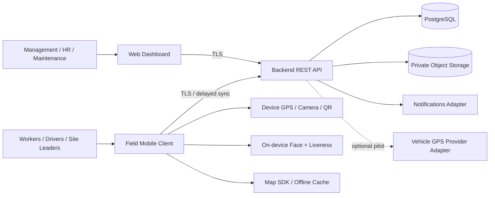

On-device verification is the network-independent trust boundary; the backend is the authoritative consistency boundary. The optional tracker adapter is not an approved dependency (OI-017).

# 6. Container and Component Architecture

**D-02 — Container layout.**

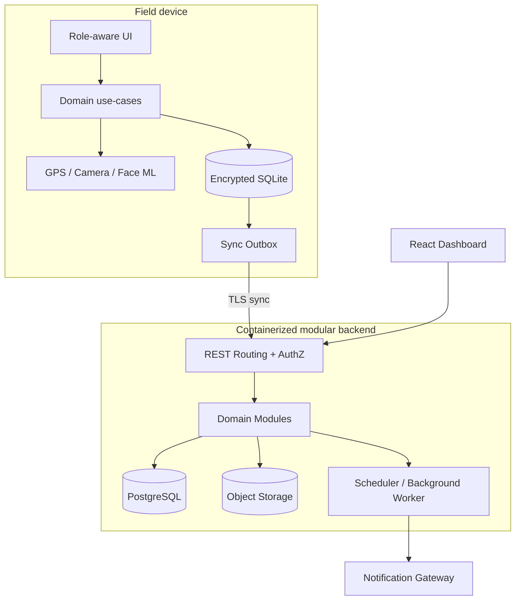

The local queue is durable; the server handles decisions requiring shared state. Domain modules communicate via interfaces and PostgreSQL transactions, not ad hoc table writes.

| Component | Responsibility | Inputs | Outputs | Dependencies | SRS requirements |
| --- | --- | --- | --- | --- | --- |
| Mobile UI + domain | Guided role flows; locally validated capture | Camera/GPS/forms | Captured events | Device APIs, local DB | FR-WFV-*, FR-SITE-*, FR-FLEET-* |
| Face/liveness engine | Embedding, active challenge, threshold | Live frames, enrolled template | Result/quality metadata | On-device ML runtime | FR-WFV-001..016 |
| Geofence engine | Circular radius calculation; accuracy handling | Site cache + GNSS fix | Inside/outside/uncertain | Device location | FR-WFV-005..009; FR-SITE-001..007 |
| Sync engine | Durable idempotent outbox; exponential backoff | Local events/media | Receipts, retries | SQLite, REST, object storage | FR-SYNC-001..010 |
| Authentication + RBAC | Access lifecycle, resource authorization | Credentials/tokens/role grants | Principal/denials | Users/roles | FR-AUTH-001..009 |
| Workers + Attendance | Enrollment ownership, verify server evidence, pair events | Biometric metadata / attendance | Accepted events, hours | Workers, sites, shifts | FR-WFV-001..029 |
| Site + Shift | Sites, geofences, workers, shift periods | Site/assignment requests | Active sites, shifts | Audit, RBAC | FR-SITE-001..011 |
| Shift Reports | 12-hour forms, manpower, incidents | Report + media | Report history, anomalies | Attendance, media | FR-REPORT-001..021 |
| Fleet + Inspections | Atomic vehicle claim, inspections, release | QR ID, evidence, issues | VehicleSession, condition | Vehicles, media, locks | FR-FLEET-001..034 |
| Trip tracking adapter | Track only during custody, GPS/OBD2 substitution | Location batches | Trip/route summaries | VehicleSession, location source | FR-FLEET-018..024, 033..034 |
| Admin + Alerts | Filtered live snapshots, case review | Sync records, anomalies | Dashboards, maintenance view | Read models, notification | FR-ADMIN-001..010 |
| Media service | Private upload/auth, integrity and references | Image/audio payload | Opaque object references | Object storage | FR-REPORT-012..013; FR-FLEET-015 |
| Audit service | Append-only actor/action/change trail | Domain critical actions | AuditEvent | PostgreSQL restricted writes | FR-SITE-008; NFR-SEC-005 |
| Scheduler/Notifications | Shift opening/missed windows; fault alerts | Shift cycles, incidents | Notifications + flags | Job execution, gateway | FR-NOTIF-001..005 |

# 7. Application Architecture

**7.1 Mobile.** UI screens/controllers → domain use-cases → interfaces/repositories → encrypted local SQLite + device integrations + REST adapter. A background sync worker is the only owner of outbox sends. Mobile framework remains [PENDING: Flutter/React Native]. Platform-native plugins must expose (a) precise GNSS fix with accuracy, elapsed-time/source; (b) camera and QR; (c) secure key store and encryption; (d) lifecycle-safe location tracking; (e) TFLite/ONNX face models. Presentation handles permissions and error states, never decides attendance acceptance independently of the domain verifier. A verified event is transactionally persisted with the outbox entry before success is shown.

**7.2 Backend.** Request controller → principal/RBAC → schema validator → domain command handler → repository/transaction → PostgreSQL + object storage. Workers execute idempotent scheduled escalation/notification and queued media finalization. Modules expose explicit ports; for example, `VehicleClaimService.claim(vehicleId, driverId, eventId)` owns the exclusive lock. Every request carries trace/correlation IDs; exception translation produces standardized errors. Row-level checks enforce that the authenticated user may act on each referenced worker, site, report or session.

**7.3 Web.** React SPA with role-aware routes and server-enforced action permissions; dashboards are projections of synchronized server state, with `last_seen_at`/`data_freshness` indicators. It must never present stale coordinates as a current live position.

**7.4 Interfaces.** Shared versioned contracts for enums, event envelopes, timestamps in UTC, coordinates in WGS84, and storage references; consumers should generate DTO validation types from OpenAPI where feasible. Models should not depend on UI framework classes.

# 8. Module Design

### 8.1 Authentication and User Management

**Purpose/responsibility:** Authenticate and bind users to one or more role grants. **Input:** Credentials, account role grants. **Output:** Principal/session state; denied attempts. **Business invariants:** Account-active and resource-scoped RBAC. **Tables:** `users, roles, user_roles`. **API:** `POST /auth/login; POST /auth/logout; GET /me`. **Security:** Credential theft, revocation, offline freshness. **Failure path:** Auth unavailable => deny untrusted first login; offline session validation [PENDING OI-001]. **Trace:** FR-AUTH-001..009.

### 8.2 Workforce Verification

**Purpose/responsibility:** Enroll several images into an embedding; discard raw frames; check live face + liveness. **Input:** Worker identity, captures, device ML model. **Output:** Enrolled template and result metadata. **Business invariants:** No stored enrollment photographs. **Tables:** `workers, biometric_templates`. **API:** `POST /workers/{id}/enrollment`. **Security:** Consent/biometric template exposure; thresholds [PENDING OI-004]. **Failure path:** Low face quality/camera failure => no enrollment. **Trace:** FR-WFV-001..004,010..016.

### 8.3 Attendance

**Purpose/responsibility:** Use signed current site snapshot; four checks; bind to shift and compute verified hours. **Input:** GPS accuracy/lat-lon, site, live embedding, liveness. **Output:** Locally queued AttendanceEvent, later accepted result. **Business invariants:** All four checks same attempt, no unverified backdate. **Tables:** `attendance_events, shifts, sites`. **API:** `POST /attendance/check-in; POST /attendance/check-out; POST /sync/events`. **Security:** Mock-location and stale assignment; server revalidation. **Failure path:** Invalid GPS/time/similarity => reject; duplicate check-in rule TBD. **Trace:** FR-WFV-005..029.

### 8.4 Site Management

**Purpose/responsibility:** Create circle from current position/map pin, assign workers, audit updates. **Input:** Center, radius, name, assignments. **Output:** Active site, change audit. **Business invariants:** Site Leader creates; Management deactivates. **Tables:** `sites, site_assignments, audit_events`. **API:** `POST /sites; PATCH /sites/{id}; POST /sites/{id}/deactivate`. **Security:** Fraudulent geofence; edits while clients offline. **Failure path:** Reject unauthorized changes; stale cached sites require flagged conflict. **Trace:** FR-SITE-001..011.

### 8.5 Shift Reporting

**Purpose/responsibility:** Schedule 12-hour reports; gather operation, progress, manpower, media, HSE. **Input:** Site shift, reports + optional images/voice. **Output:** ShiftReport + alert flags. **Business invariants:** Incident/failed equipment flagged; missed window escalated. **Tables:** `shifts, shift_reports, media_objects`. **API:** `POST /shift-reports; GET /shift-reports`. **Security:** Report amendment policy OI-012; inaccurate offline manpower. **Failure path:** Validate fields; local pending submission on network loss. **Trace:** FR-REPORT-001..021.

### 8.6 Fleet Management

**Purpose/responsibility:** Register vehicle and QR; assign authoritative custody. **Input:** Vehicle QR and driver. **Output:** VehicleSession status. **Business invariants:** At most one *server-accepted* active session/vehicle. **Tables:** `vehicles, vehicle_sessions`. **API:** `POST /vehicle-sessions/claim`. **Security:** Cloned QR, offline double claim. **Failure path:** Collision => 409; disconnected claim provisional/blocked per OI-020. **Trace:** FR-FLEET-001..006,032.

### 8.7 Vehicle Assignment

**Purpose/responsibility:** Single active claim, custody start/end timestamps. **Input:** Vehicle ID, driver ID, client event ID. **Output:** Vehicle locked until valid release. **Business invariants:** Claim only available vehicle; no concurrent claims. **Tables:** `vehicle_sessions, vehicles`. **API:** `POST /vehicle-sessions/claim; POST /vehicle-sessions/{id}/release`. **Security:** Replay or concurrent claims. **Failure path:** DB unique partial index; retries return same outcome. **Trace:** FR-FLEET-003..006,028..032.

### 8.8 Vehicle Inspection

**Purpose/responsibility:** Require four exterior + dashboard image before start; end odometer/issues. **Input:** Photos, answers, description, odometer. **Output:** Pre/post inspection and evidence references. **Business invariants:** Cannot start until valid pre; post required for release. **Tables:** `vehicle_inspections, media_objects, evidence_links`. **API:** `POST /vehicle-sessions/{id}/inspections`. **Security:** Image substitution, invalid media. **Failure path:** Incomplete => 422, release exception OI-016. **Trace:** FR-FLEET-007..017,023..027,031.

### 8.9 Trip Tracking

**Purpose/responsibility:** Sample route while session open; produce trip origin/route/destination. **Input:** Location timestamp, accuracy, odometer. **Output:** Trip points and summary. **Business invariants:** Tracking at claim; off at release. **Tables:** `trips, trip_locations`. **API:** `POST /vehicle-sessions/{id}/locations/batch`. **Security:** Tracking leakage, stale location, GPS spoofing. **Failure path:** Tracking provider unavailable => degraded status + alert [PENDING]. **Trace:** FR-FLEET-018..024,033..034.

### 8.10 Notifications

**Purpose/responsibility:** Open-window prompt, missed-report escalation, maintenance issue. **Input:** Shift timer and flagged operational events. **Output:** User/admin notifications. **Business invariants:** Re-delivery cannot multiply case records. **Tables:** `notifications, flagged_events`. **API:** `GET /notifications; POST /notifications/{id}/ack`. **Security:** Unbounded retries; recipients TBD. **Failure path:** Provider down => retry queue; channel policy OI-011. **Trace:** FR-NOTIF-001..005.

### 8.11 Reporting and Historical Records

**Purpose/responsibility:** Filter attendance/shift/vehicle histories by site/time. **Input:** Authorized filters, pagination. **Output:** Time-ordered archives and calculated summaries. **Business invariants:** Read authoritative accepted events only. **Tables:** `attendance_events, shift_reports, trips`. **API:** `GET /attendance/events; GET /shift-reports; GET /vehicles/{id}/history`. **Security:** Excessive data exposure. **Failure path:** Database degraded => read-only error, do not fabricate live state. **Trace:** FR-ADMIN-001..010.

### 8.12 Administration

**Purpose/responsibility:** Review anomalies, see data freshness, deactivate sites. **Input:** Authorized actors, filters and decisions. **Output:** Admin views/audit records. **Business invariants:** Server authorizes each action. **Tables:** `flagged_events, audit_events`. **API:** `GET /admin/flags; POST /sites/{id}/deactivate`. **Security:** IDOR and privilege escalation. **Failure path:** Missing role => 403; missing sync => stale badge. **Trace:** FR-ADMIN-001..010.

### 8.13 Audit Logging

**Purpose/responsibility:** Write append-only site change and significant security transition. **Input:** Actor, action, old/new metadata, correlation. **Output:** Immutable audit event. **Business invariants:** No app-level UPDATE/DELETE permissions. **Tables:** `audit_events`. **API:** `GET /admin/audit-events`. **Security:** Audit deletion/tampering. **Failure path:** Audit persistence failure => abort critical site changes. **Trace:** FR-SITE-008; NFR-SEC-005.

# 9. Data Flow Design

**D-03 — Logical data flow.**

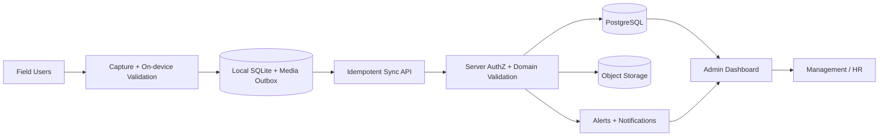

Authenticity checks on the phone produce evidence; central validation resolves authorization, claims and duplicate rules. Sync receipt ties server outcome to client event; attachments are uploaded independently but cannot lose their owner association.

| Flow | Local validation | Central validation | Persistence |
|---|---|---|---|
| Login | Cached session policy [PENDING] | Credentials, status, RBAC | Users + audit as applicable |
| Enrollment | Consent state, sample quality, embedding | Enrollment authority, worker linkage | biometric_templates (no raw faces) |
| Check-in/out | Geofence, mock state, liveness, match | User/site/time evidence, duplicate rules | attendance_events, SyncReceipt |
| Site creation | Form/geofence geometry | Role, ranges, revision/audit | sites, site_assignments, audit_events |
| 12-hour report | Fields, incident/notes, shift ID | Submitter/site/shift, media metadata | shift_reports, evidence_links |
| QR claim / inspection | QR decode, gated evidence capture | Unique active claim, session ownership | vehicle_sessions, vehicle_inspections |
| Route points/release | Sensor capture scoped to open session | Accepted session/timing, distance constraints | trips, trip_locations |
| Media upload | Local file hash, size and owner | MIME/size/owner, integrity, malware screening [DESIGN] | media_objects in DB, bytes in object storage |

# 10. Database Design and Technology

**[REQ + DESIGN]** PostgreSQL is named in proposal §8 and compatible with SRS §7–8. It is the authoritative database. Use UUID primary keys (client-generated UUIDv7/UUIDv4 for offline events), `timestamptz` UTC, `numeric(10,7)` for latitude and `numeric(11,7)` for longitude, `numeric(12,2)` for measurements where precision matters, `jsonb` for bounded evidence-result metadata (not as replacement for key relations). Enforce referential integrity and uniqueness in PostgreSQL, not only application code. Actual media binary goes into private object storage; database stores IDs, hashes, MIME, state and owner linkage. Sensitive embeddings should be encrypted and preferably isolated from normal report-read accounts. Client SQLite mirrors only the subset needed for authenticated offline duties plus outbox/events, never the entire partner database.

**Transaction strategy.** A claim uses `INSERT ... ON CONFLICT` / row lock plus partial unique constraint on active sessions; server returns a stable result for duplicate event ID. Site mutation and immutable audit insert execute in one transaction. Sync receipts deduplicate at ingress. Shift report revisions are append/supersede **only if** OI-012 approves edits. Referential deletion defaults to `RESTRICT` on evidence-critical history; erasure/retention policy remains [PENDING OI-023]. Database schema below is a **proposed implementation**, not a newly approved business requirement.

# 11. Entity Relationship Diagram (ERD)

**D-04 — Core relational ERD.**

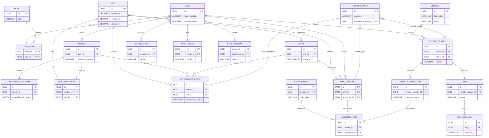

Optional relationships are modeled with nullable foreign keys; `FLAGGED_EVENT` references only one applicable source using a discriminator plus guarded typed references. `EVIDENCE_LINK` likewise must reference exactly one parent. The ERD is schematic; the data dictionary and constraints are the authoritative column-level design.

# 12. Database Schema and Data Dictionary

The following schema is the **proposed PostgreSQL logical schema**, not a physical migration. `generated` denotes server UUID defaults except where offline clients mint durable event IDs. `—` indicates absent default. Foreign keys are `RESTRICT` unless the approved data lifecycle specifies otherwise. Nullability of optional consent/clock/route fields may change after the listed OIs. The `one parent only` evidence-link rule is enforced with a `CHECK` summing non-null parent references.

### users

| Column | PostgreSQL type | PK/FK | Nullable | Default | Constraints | Description |
| --- | --- | --- | --- | --- | --- | --- |
| id | UUID | PK | No | generated | immutable | Account ID |
| employee_code | VARCHAR(64) | UQ | Yes | — | unique when set | Partner workforce identifier |
| full_name | VARCHAR(160) | — | No | — | nonblank | Display identity |
| login_identifier | VARCHAR(190) | UQ | No | — | unique, normalized | Login principal; scheme TBD |
| credential_hash | TEXT | — | Yes | NULL | only for local-password option | Password hash; omit for external IdP |
| account_status | VARCHAR(16) | — | No | active | CHECK(active,inactive) | Authorization status |
| created_at | TIMESTAMPTZ | — | No | now() | UTC | Creation timestamp |
| updated_at | TIMESTAMPTZ | — | No | now() | UTC | Last account update |

### roles

| Column | PostgreSQL type | PK/FK | Nullable | Default | Constraints | Description |
| --- | --- | --- | --- | --- | --- | --- |
| id | UUID | PK | No | generated | immutable | Role ID |
| code | VARCHAR(48) | UQ | No | — | unique | WORKER/SITE_LEADER/DRIVER/MANAGEMENT_HR/MAINTENANCE/ENROLLMENT_STAFF |
| name | VARCHAR(100) | — | No | — | nonblank | Display name |

### user_roles

| Column | PostgreSQL type | PK/FK | Nullable | Default | Constraints | Description |
| --- | --- | --- | --- | --- | --- | --- |
| user_id | UUID | PK,FK users | No | — | ON DELETE RESTRICT | User grant target |
| role_id | UUID | PK,FK roles | No | — | ON DELETE RESTRICT | Granted role |
| grant_status | VARCHAR(16) | — | No | active | CHECK(active,revoked) | Revocation state |
| granted_at | TIMESTAMPTZ | — | No | now() | UTC | Assignment time |
| granted_by | UUID | FK users | Yes | NULL | record original actor | Grant source |

### workers

| Column | PostgreSQL type | PK/FK | Nullable | Default | Constraints | Description |
| --- | --- | --- | --- | --- | --- | --- |
| id | UUID | PK | No | generated | immutable | Worker ID |
| user_id | UUID | UQ,FK users | No | — | unique | Linked user |
| consent_status | VARCHAR(20) | — | No | pending | policy TBD | Consent workflow status |
| enrollment_status | VARCHAR(20) | — | No | not_enrolled | CHECK(not_enrolled,enrolled,suspended) | Biometric availability |
| created_at | TIMESTAMPTZ | — | No | now() | UTC | Profile creation |

### biometric_templates

| Column | PostgreSQL type | PK/FK | Nullable | Default | Constraints | Description |
| --- | --- | --- | --- | --- | --- | --- |
| id | UUID | PK | No | generated | immutable | Template version ID |
| worker_id | UUID | FK workers | No | — | ON DELETE RESTRICT | Template owner |
| model_version | VARCHAR(80) | — | No | — | nonblank | Embedding model revision |
| embedding_ciphertext | BYTEA | — | No | — | AEAD encrypted | Sensitive embedding vector |
| enrolled_at | TIMESTAMPTZ | — | No | now() | UTC | Enrollment time |
| active | BOOLEAN | — | No | true | at most one active per worker | Selection state |
| consent_reference | VARCHAR(128) | — | Yes | NULL | policy TBD | Consent proof reference |

### sites

| Column | PostgreSQL type | PK/FK | Nullable | Default | Constraints | Description |
| --- | --- | --- | --- | --- | --- | --- |
| id | UUID | PK | No | generated | immutable | Site ID |
| name | VARCHAR(160) | — | No | — | nonblank | Field site name |
| center_lat | NUMERIC(10,7) | — | No | — | CHECK between -90 and 90 | Geofence center latitude |
| center_lon | NUMERIC(11,7) | — | No | — | CHECK between -180 and 180 | Geofence center longitude |
| radius_m | NUMERIC(9,2) | — | No | — | CHECK > 0; bounds TBD | Circular geofence radius |
| status | VARCHAR(16) | — | No | active | CHECK(active,inactive) | Current activation state |
| revision | BIGINT | — | No | 1 | CHECK > 0 | Optimistic config version |
| created_by | UUID | FK users | No | — | ON DELETE RESTRICT | Authorized site leader |
| created_at | TIMESTAMPTZ | — | No | now() | UTC | Audit timestamp |

### site_assignments

| Column | PostgreSQL type | PK/FK | Nullable | Default | Constraints | Description |
| --- | --- | --- | --- | --- | --- | --- |
| id | UUID | PK | No | generated | immutable | Assignment ID |
| site_id | UUID | FK sites | No | — | ON DELETE RESTRICT | Site |
| worker_id | UUID | FK workers | No | — | ON DELETE RESTRICT | Worker |
| effective_from | TIMESTAMPTZ | — | Yes | NULL | OI-008 | Validity start |
| effective_until | TIMESTAMPTZ | — | Yes | NULL | greater than start if set | Validity end |
| status | VARCHAR(16) | — | No | active | CHECK(active,inactive) | Active site assignment |
| assigned_by | UUID | FK users | No | — | role check | Assigning actor |

### shifts

| Column | PostgreSQL type | PK/FK | Nullable | Default | Constraints | Description |
| --- | --- | --- | --- | --- | --- | --- |
| id | UUID | PK | No | generated | immutable | Shift occurrence ID |
| site_id | UUID | FK sites | No | — | ON DELETE RESTRICT | Site |
| cycle | VARCHAR(12) | — | No | — | CHECK(day,night) or approved config | Reporting cycle |
| starts_at | TIMESTAMPTZ | — | No | — | UTC | Shift start |
| ends_at | TIMESTAMPTZ | — | No | — | CHECK end > start | Shift end; standard 12-hour reporting cycle |
| standard_minutes | INTEGER | — | Yes | NULL | OI-010 | Worked-hours comparison target |
| report_window_opens_at | TIMESTAMPTZ | — | Yes | NULL | OI-011 | Start reminder window |
| report_window_closes_at | TIMESTAMPTZ | — | Yes | NULL | OI-011 | Missed-report threshold |

### attendance_events

| Column | PostgreSQL type | PK/FK | Nullable | Default | Constraints | Description |
| --- | --- | --- | --- | --- | --- | --- |
| id | UUID | PK | No | client-generated | idempotent | Stable event ID |
| event_type | VARCHAR(16) | — | No | — | CHECK(check_in,check_out) | Verification action |
| worker_id | UUID | FK workers | No | — | ON DELETE RESTRICT | Verified worker |
| site_id | UUID | FK sites | No | — | ON DELETE RESTRICT | Assigned site |
| shift_id | UUID | FK shifts | Yes | NULL | shift pairing TBD | Shift context |
| paired_checkin_id | UUID | FK attendance_events | Yes | NULL | only for check_out | Check-in association |
| captured_at | TIMESTAMPTZ | — | No | — | client signed/wall clock trust OI-022 | Event capture time |
| received_at | TIMESTAMPTZ | — | No | now() | server set | Sync arrival time |
| latitude | NUMERIC(10,7) | — | No | — | valid range | Reported GPS latitude |
| longitude | NUMERIC(11,7) | — | No | — | valid range | Reported GPS longitude |
| accuracy_m | NUMERIC(9,2) | — | Yes | NULL | threshold OI-006 | Reported location accuracy |
| geofence_revision | BIGINT | — | No | — | > 0 | Used site rules version |
| mock_location_detected | BOOLEAN | — | No | false | no acceptance when true | OS signal |
| liveness_pass | BOOLEAN | — | No | false | no acceptance when false | Liveness result |
| face_match_pass | BOOLEAN | — | No | false | no acceptance when false | Threshold-comparison result |
| verification_model_version | VARCHAR(80) | — | No | — | model traceability | ML model version |
| acceptance_status | VARCHAR(24) | — | No | pending | CHECK(pending,accepted,rejected,flagged) | Server decision |
| rejection_code | VARCHAR(80) | — | Yes | NULL | no sensitive scores | Non-secret reason |

### shift_reports

| Column | PostgreSQL type | PK/FK | Nullable | Default | Constraints | Description |
| --- | --- | --- | --- | --- | --- | --- |
| id | UUID | PK | No | client-generated | immutable event identity | Report ID |
| shift_id | UUID | FK shifts | No | — | may be unique subject to OI-012 | Report's shift |
| site_id | UUID | FK sites | No | — | must match shift site | Site |
| submitted_by | UUID | FK users | No | — | site-leader RBAC | Submitting leader |
| submitted_at | TIMESTAMPTZ | — | No | — | UTC/source | Submission time |
| work_completed | TEXT | — | No | — | nonblank | Structured narrative |
| progress_metric | NUMERIC(14,3) | — | No | — | domain range TBD | Measured depth/progress |
| manpower_count | INTEGER | — | Yes | NULL | system computed | Verified attendance count |
| equipment_status | VARCHAR(24) | — | No | — | CHECK(operational,degraded,down) | Equipment state |
| equipment_notes | TEXT | — | Yes | NULL | — | Equipment explanation |
| hse_incident | BOOLEAN | — | No | false | — | HSE flag |
| hse_details | TEXT | — | Yes | NULL | required if incident | Incident detail |
| delay_reason | VARCHAR(48) | — | Yes | NULL | domain categories | Weather/equipment/supply/personnel |
| delay_notes | TEXT | — | Yes | NULL | — | Delay explanation |
| supersedes_report_id | UUID | FK shift_reports | Yes | NULL | only after OI-012 | Optional correction link |

### vehicles

| Column | PostgreSQL type | PK/FK | Nullable | Default | Constraints | Description |
| --- | --- | --- | --- | --- | --- | --- |
| id | UUID | PK | No | generated | immutable | Vehicle ID |
| fleet_label | VARCHAR(80) | UQ | No | — | unique | Partner fleet identifier |
| qr_identifier_hash | VARCHAR(128) | UQ | No | — | unique, QR scheme TBD | QR payload binding |
| status | VARCHAR(16) | — | No | available | CHECK(available,in_use) | Projected availability |
| created_at | TIMESTAMPTZ | — | No | now() | UTC | Vehicle master record |

### vehicle_sessions

| Column | PostgreSQL type | PK/FK | Nullable | Default | Constraints | Description |
| --- | --- | --- | --- | --- | --- | --- |
| id | UUID | PK | No | client-generated | immutable idempotency key | Custody session ID |
| vehicle_id | UUID | FK vehicles | No | — | one active per vehicle | Vehicle |
| driver_id | UUID | FK users | No | — | DRIVER permission | Current driver |
| status | VARCHAR(28) | — | No | claimed | CHECK(claimed,pre_inspected,trip_started,post_inspected,released,conflicted) | Custody lifecycle |
| claimed_at | TIMESTAMPTZ | — | No | — | UTC/source | Custody start |
| released_at | TIMESTAMPTZ | — | Yes | NULL | >= claimed time | Custody end |
| server_accepted_at | TIMESTAMPTZ | — | Yes | NULL | server-authorized | Lock decision moment |
| provisional | BOOLEAN | — | No | false | OI-020 governs offline | Awaiting conflict resolution |
| revision | BIGINT | — | No | 1 | positive | Optimistic transition version |

### vehicle_inspections

| Column | PostgreSQL type | PK/FK | Nullable | Default | Constraints | Description |
| --- | --- | --- | --- | --- | --- | --- |
| id | UUID | PK | No | client-generated | immutable | Inspection ID |
| vehicle_session_id | UUID | FK vehicle_sessions | No | — | ON DELETE RESTRICT | Custody context |
| inspection_type | VARCHAR(8) | — | No | — | CHECK(pre,post) | Inspection stage |
| captured_at | TIMESTAMPTZ | — | No | — | UTC/source | Inspection time |
| odometer_value_km | NUMERIC(12,1) | — | Yes | NULL | entered/verified policy TBD | Displayed reading |
| fuel_level_note | VARCHAR(80) | — | Yes | NULL | pre inspection | Fuel evidence text |
| warning_or_damage | BOOLEAN | — | Yes | NULL | required for pre | Visible damage/warnings |
| trip_issue | BOOLEAN | — | Yes | NULL | required for post | Mechanical/accident response |
| issue_description | TEXT | — | Yes | NULL | required when issue true | Text or voice reference |
| completion_status | VARCHAR(20) | — | No | incomplete | CHECK(incomplete,complete,exception) | Evidence validation state |

### trips

| Column | PostgreSQL type | PK/FK | Nullable | Default | Constraints | Description |
| --- | --- | --- | --- | --- | --- | --- |
| id | UUID | PK | No | client-generated | immutable | Trip ID |
| vehicle_session_id | UUID | UQ,FK vehicle_sessions | No | — | unique session trip assumption | Custody association |
| started_at | TIMESTAMPTZ | — | Yes | NULL | >= claim | Trip start action |
| ended_at | TIMESTAMPTZ | — | Yes | NULL | >= started | Trip end action |
| status | VARCHAR(16) | — | No | pending | CHECK(pending,in_progress,completed) | Trip lifecycle |
| odometer_distance_km | NUMERIC(12,1) | — | Yes | NULL | >= 0 | Derived from photos/readings |
| route_distance_km | NUMERIC(12,3) | — | Yes | NULL | >= 0 | Accumulated GPS trajectory |
| origin_lat | NUMERIC(10,7) | — | Yes | NULL | valid latitude | First known origin |
| origin_lon | NUMERIC(11,7) | — | Yes | NULL | valid longitude | First known origin |
| destination_lat | NUMERIC(10,7) | — | Yes | NULL | valid latitude | Last known destination |
| destination_lon | NUMERIC(11,7) | — | Yes | NULL | valid longitude | Last known destination |

### trip_locations

| Column | PostgreSQL type | PK/FK | Nullable | Default | Constraints | Description |
| --- | --- | --- | --- | --- | --- | --- |
| id | UUID | PK | No | client-generated | deduplicated | Location sample ID |
| trip_id | UUID | FK trips | No | — | ON DELETE RESTRICT | Trip |
| captured_at | TIMESTAMPTZ | — | No | — | monotonic sequence checked | Point time |
| latitude | NUMERIC(10,7) | — | No | — | valid latitude | Sample position |
| longitude | NUMERIC(11,7) | — | No | — | valid longitude | Sample position |
| accuracy_m | NUMERIC(9,2) | — | Yes | NULL | >= 0 | Reported quality |
| source | VARCHAR(20) | — | No | phone | CHECK(phone,obd2,provider) | Location adapter ID |
| received_at | TIMESTAMPTZ | — | No | now() | server set | Last available timestamp |

### media_objects

| Column | PostgreSQL type | PK/FK | Nullable | Default | Constraints | Description |
| --- | --- | --- | --- | --- | --- | --- |
| id | UUID | PK | No | client-generated | immutable | Blob identifier |
| created_by | UUID | FK users | No | — | owner | Uploader |
| object_key | TEXT | UQ | No | — | private opaque key | Private object storage path |
| mime_type | VARCHAR(100) | — | No | — | allowlist TBD | Declared validated type |
| byte_size | BIGINT | — | No | — | CHECK >= 0, cap TBD | Object size |
| sha256_hex | CHAR(64) | — | No | — | integrity check | SHA-256 content hash |
| captured_at | TIMESTAMPTZ | — | Yes | NULL | optional source metadata | Local capture time |
| status | VARCHAR(20) | — | No | pending | CHECK(pending,uploaded,verified,failed) | Upload lifecycle |

### evidence_links

| Column | PostgreSQL type | PK/FK | Nullable | Default | Constraints | Description |
| --- | --- | --- | --- | --- | --- | --- |
| id | UUID | PK | No | generated | immutable | Evidence link ID |
| media_id | UUID | FK media_objects | No | — | ON DELETE RESTRICT | Referenced media |
| shift_report_id | UUID | FK shift_reports | Yes | NULL | one parent only | Report reference |
| inspection_id | UUID | FK vehicle_inspections | Yes | NULL | one parent only | Inspection reference |
| kind | VARCHAR(32) | — | No | — | enumerated by parent | front/rear/left/right/dashboard/odometer/voice/progress |
| captured_lat | NUMERIC(10,7) | — | Yes | NULL | location provenance | Image capture latitude |
| captured_lon | NUMERIC(11,7) | — | Yes | NULL | location provenance | Image capture longitude |
| captured_at | TIMESTAMPTZ | — | Yes | NULL | required for inspection image | Capture timestamp |

### flagged_events

| Column | PostgreSQL type | PK/FK | Nullable | Default | Constraints | Description |
| --- | --- | --- | --- | --- | --- | --- |
| id | UUID | PK | No | generated | immutable | Alert/case ID |
| category | VARCHAR(48) | — | No | — | allowlist | Mock, liveness, HSE, fault, missed report, sync conflict |
| attendance_event_id | UUID | FK attendance_events | Yes | NULL | at most one source | Attendance source |
| shift_report_id | UUID | FK shift_reports | Yes | NULL | at most one source | Report source |
| vehicle_session_id | UUID | FK vehicle_sessions | Yes | NULL | at most one source | Custody source |
| site_id | UUID | FK sites | Yes | NULL | optional context | Site context |
| status | VARCHAR(24) | — | No | open | review workflow TBD | Open/reviewed/closed candidate |
| created_at | TIMESTAMPTZ | — | No | now() | UTC | Event timestamp |
| assigned_to | UUID | FK users | Yes | NULL | permissions TBD | Review owner |

### notifications

| Column | PostgreSQL type | PK/FK | Nullable | Default | Constraints | Description |
| --- | --- | --- | --- | --- | --- | --- |
| id | UUID | PK | No | generated | immutable | Notification ID |
| recipient_id | UUID | FK users | No | — | RBAC | Target user |
| kind | VARCHAR(48) | — | No | — | report_open/missed/fleet_fault | Notification type |
| related_flag_id | UUID | FK flagged_events | Yes | NULL | source reference | Alert linkage |
| scheduled_for | TIMESTAMPTZ | — | No | — | UTC | Dispatch time |
| sent_at | TIMESTAMPTZ | — | Yes | NULL | UTC | Gateway success time |
| status | VARCHAR(20) | — | No | queued | CHECK(queued,sent,failed,acknowledged) | Delivery state |
| attempts | INTEGER | — | No | 0 | CHECK >= 0 | Retry counter |

### audit_events

| Column | PostgreSQL type | PK/FK | Nullable | Default | Constraints | Description |
| --- | --- | --- | --- | --- | --- | --- |
| id | UUID | PK | No | generated | append only | Immutable audit ID |
| actor_id | UUID | FK users | Yes | NULL | service actor allowed | User or system actor |
| action | VARCHAR(64) | — | No | — | nonblank | CREATE_SITE, MODIFY_SITE etc |
| entity_type | VARCHAR(64) | — | No | — | allowlist | Audited domain type |
| entity_id | UUID | — | No | — | indexed | Target record ID |
| occurred_at | TIMESTAMPTZ | — | No | now() | server time | Audit time |
| request_id | UUID | — | Yes | NULL | correlation | API request linkage |
| result | VARCHAR(20) | — | No | success | success/denied/conflict | Outcome |
| safe_metadata | JSONB | — | No | '{}' | redacted/no credentials | Change context/hash; privacy-reviewed |
| previous_hash | CHAR(64) | — | Yes | NULL | tamper evidence [DESIGN] | Prior log digest |
| entry_hash | CHAR(64) | — | Yes | NULL | tamper evidence [DESIGN] | Current digest |

### sync_receipts

| Column | PostgreSQL type | PK/FK | Nullable | Default | Constraints | Description |
| --- | --- | --- | --- | --- | --- | --- |
| event_id | UUID | PK | No | client-generated | deduplication key | Accepted/rejected envelope ID |
| submitted_by | UUID | FK users | No | — | actor | Uploader |
| entity_type | VARCHAR(48) | — | No | — | allowlist | Event routing type |
| entity_id | UUID | — | No | — | correlation | Resulting domain ID |
| status | VARCHAR(24) | — | No | — | CHECK(accepted,rejected,conflicted) | Processing result |
| received_at | TIMESTAMPTZ | — | No | now() | server time | Arrival time |
| reason_code | VARCHAR(80) | — | Yes | NULL | no sensitive material | Failure reason |
| payload_hash | CHAR(64) | — | No | — | SHA-256 | Detect inconsistent replay |

**Device-only SQLite entities (not central tables).** `local_event_outbox(event_id PK, entity_type, encrypted_payload, captured_at, status, attempt_count, next_attempt_at, payload_hash)`, `local_media_outbox(media_id PK, parent_event_id, encrypted_local_path, sha256, status, bytes_sent)`, and `local_config_cache(resource_id, version, expires_at, signed_snapshot)` implement disconnected capture. These are versioned caches, not independent system-of-record entities. Schema encryption/keying and purge are bound to an approved device/retention policy (OI-021/023/024).

# 13. Database Relationships

A user can hold multiple roles (`user_roles` join table); a worker is an optional one-to-one extension of `users`. Many workers attend many sites through `site_assignments` with effective dates [PENDING OI-008]. A site has many shift occurrences and attendance events; each verified event references one worker and one site and optionally one shift. Attendance pairs are a deterministic association through `paired_checkin_id`; no inferred check-out becomes a verified event. A shift can have zero or more historical report versions; policy for correction remains OI-012. A vehicle has many historical sessions but **at most one active accepted session**. One session has a pre and post inspection and, in this baseline, at most one Trip [PENDING OI-015]. A trip has many sampled points. Evidence media has private object ownership and one typed domain parent. Flagged items reference one originating record; audit events reference actor/entity without cascading deletion.

**Open modeling decisions:** if the partner requires multiple trips within a custody period, remove `trips.vehicle_session_id UNIQUE` and revise state/diagram semantics; if a shift report must exist exactly once, add partial unique `(shift_id, current_revision)` after OI-012; shift overlap/exceptions depend on OI-010 and OI-009.

# 14. Database Integrity Constraints

**Required/proposed DDL invariants (adapt syntax during migration):**
```sql
CREATE UNIQUE INDEX uq_vehicle_active_claim
 ON vehicle_sessions(vehicle_id)
 WHERE status IN ('claimed','pre_inspected','trip_started','post_inspected')
       AND provisional = false;
CREATE UNIQUE INDEX uq_worker_active_embedding
 ON biometric_templates(worker_id) WHERE active = true;
CREATE UNIQUE INDEX uq_session_inspection_stage
 ON vehicle_inspections(vehicle_session_id, inspection_type)
 WHERE completion_status <> 'exception';
CREATE INDEX idx_attendance_site_time ON attendance_events(site_id, captured_at DESC);
CREATE INDEX idx_attendance_worker_time ON attendance_events(worker_id, captured_at DESC);
CREATE INDEX idx_location_trip_time ON trip_locations(trip_id, captured_at);
CREATE INDEX idx_reports_site_shift ON shift_reports(site_id, shift_id);
CREATE INDEX idx_flagged_status_time ON flagged_events(status, created_at DESC);
ALTER TABLE evidence_links ADD CONSTRAINT one_evidence_owner
 CHECK ((shift_report_id IS NOT NULL)::int + (inspection_id IS NOT NULL)::int = 1);
```

Add `CHECK latitude BETWEEN -90 AND 90`, longitude `BETWEEN -180 AND 180`, `radius_m > 0`, nonnegative distances, and `ends_at > starts_at` across relevant tables. Enforce site/shift linkage and stage gating inside a transaction/domain handler, not only UI. Reject client-controlled claims to server `received_at`. The active-session index guarantees uniqueness among **accepted** sessions only; provisional offline sessions remain unresolved pending OI-020. No cascade delete on audit/attendance/inspection/trip records; retention policy and permitted anonymization are OI-023. Use `revision` compare-and-swap for mutable sites and custody transitions.

# 15. Indexing Strategy

| Index / columns | Query supported | Write/read trade-off |
| --- | --- | --- |
| attendance_events(worker_id,captured_at DESC) | Worker history, pairing and payroll | Additional index write per check |
| attendance_events(site_id,captured_at DESC) | Site attendance monitoring | Supports date/site filters |
| site_assignments(worker_id,site_id,status) | Assigned active geofences for mobile sync | Fast worker lookup |
| shift_reports(site_id,shift_id) | Chronological site reporting | Small write overhead |
| vehicle_sessions(vehicle_id) active partial UNIQUE | Authoritative exclusive custody | Mandatory consistency, transaction retries |
| vehicle_sessions(driver_id,claimed_at DESC) | Driver custody history | Moderate index write |
| trip_locations(trip_id,captured_at) | Ordered route replay | High-volume ingest: partition only when measured |
| flagged_events(status,created_at DESC) | Administrator review queue | New alert creation cost |
| audit_events(entity_type,entity_id,occurred_at) | Auditing object changes | Potential large history |
| sync_receipts(event_id) PK | Idempotency lookup | Mandatory for every sync event |

# 16. Historical Data and Audit Design

Attendance captures, completed inspections, route samples and custody transitions are historical evidence; avoid in-place edits to recorded values. Corrections, if permitted, should be separate `correction` events referencing original IDs and retain original hashes [DESIGN; approval OI-009/012/023]. PostgreSQL permissions prohibit ordinary actors from modifying `audit_events`; service inserts are atomic with site creation/update/deactivation. A central append-only stream may additionally use digest chaining and restricted export/backup to make undetected tampering harder; this is **tamper-evidence**, not a proof of absolute immutability. Ensure `actor_id`, server and device timestamps (distinguished), action, entity ID, prior/new allowed values, correlation ID, and decision reason. Deactivation must not erase historical attendance or site references. Media retention/erasure/legal hold unresolved (OI-023).

# 17. API Architecture

**Base:** `/api/v1` over HTTPS; JSON (`application/json`) for commands/queries; `multipart/form-data` or authorized direct-to-object upload for media. Every protected request uses an approved principal/session; `Authorization: Bearer <token>` is a **proposed** implementation, not a decision on the ultimate credential scheme (OI-001). Mutating offline-sensitive requests include `Idempotency-Key: <event_uuid>` and `X-Correlation-ID`. Timestamps: RFC 3339 UTC with offset; coordinates WGS84 decimal degrees; distances named with units (`*_m`, `*_km`). Sensitive face vectors are never echoed in standard API responses.

**Pagination:** `limit` plus opaque `cursor`; maximum page size [TBD]. **Filters:** server allowlist (`siteId`, `from`, `to`, `status`, `vehicleId`, `workerId`) with resource-scoped authorization. **Sorting:** explicit allowlist (typically latest first); no arbitrary SQL sort. **Rate limits:** endpoint/role/device-specific [TBD] with 429 `Retry-After`; low-connectivity queue should obey backoff. **Versioning:** major-breaking contracts get `/api/v2`; additive fields permitted with optional defaults and model version logging. **Authority:** online domain endpoints and `/sync/events` use the *same domain handlers*, event IDs and transactional dedupe; otherwise different routes could create contradictory records.

**Implementation contracts:** OpenAPI 3.x (generated from actual handlers), strict schema validation, content-type limits, authenticated media grants and per-file SHA-256; server-issued `receivedAt`; request IDs returned in all errors. Client-event time is stored separately; server rejects impossible/replayed evidence based on approved clock-drift policy [PENDING OI-022].

# 18. API Endpoint Catalogue

### Auth

| Method | Endpoint (prefixed /api/v1) | Purpose | Actor / permission | Auth | Related SRS |
| --- | --- | --- | --- | --- | --- |
| POST | /auth/login | Authenticate | All | Yes | FR-AUTH-001 |
| POST | /auth/logout | Invalidate session | All | Yes | FR-AUTH-001; OI-001 |
| POST | /auth/refresh | Refresh proposed token session | All | Yes | OI-001 |

### Users

| Method | Endpoint (prefixed /api/v1) | Purpose | Actor / permission | Auth | Related SRS |
| --- | --- | --- | --- | --- | --- |
| GET | /me | Own roles and policy snapshot | All | Yes | FR-AUTH-002..003 |
| POST | /users | Provision staff [DERIVED] | Admin/Enrollment staff TBD | Yes | FR-AUTH-006 |
| PATCH | /users/{id}/status | Deactivate account | Admin TBD | Yes | FR-AUTH-007..008 |

### Enrollment

| Method | Endpoint (prefixed /api/v1) | Purpose | Actor / permission | Auth | Related SRS |
| --- | --- | --- | --- | --- | --- |
| POST | /workers/{id}/enrollment | Submit encrypted worker embedding metadata | Worker/Enrollment staff TBD | Yes | FR-WFV-001..004 |

### Sites

| Method | Endpoint (prefixed /api/v1) | Purpose | Actor / permission | Auth | Related SRS |
| --- | --- | --- | --- | --- | --- |
| GET | /sites/assigned | Assigned sites + signed revisions | Worker/Site Leader | Yes | FR-WFV-006; FR-SITE-006 |
| POST | /sites | Create site | Site Leader | Yes | FR-SITE-001..008 |
| PATCH | /sites/{id} | Revise site geometry/name/assignments | Site Leader authorized | Yes | FR-SITE-008,011 |
| POST | /sites/{id}/deactivate | Deactivate active site | Management/HR | Yes | FR-SITE-009..010 |
| PUT | /sites/{id}/assignments | Replace authorized roster | Site Leader per OI-008 | Yes | FR-SITE-006 |

### Shifts

| Method | Endpoint (prefixed /api/v1) | Purpose | Actor / permission | Auth | Related SRS |
| --- | --- | --- | --- | --- | --- |
| GET | /shifts?siteId={id} | Return shift schedule/report windows | Site Leader/Worker | Yes | FR-WFV-022; FR-REPORT-005 |

### Attendance

| Method | Endpoint (prefixed /api/v1) | Purpose | Actor / permission | Auth | Related SRS |
| --- | --- | --- | --- | --- | --- |
| POST | /attendance/check-in | Synchronous event submission | Worker | Yes | FR-WFV-005..018 |
| POST | /attendance/check-out | Synchronous event submission | Worker | Yes | FR-WFV-019..023 |
| GET | /attendance/events | Filtered attendance history | Management/HR | Yes | FR-ADMIN-001 |

### Reports

| Method | Endpoint (prefixed /api/v1) | Purpose | Actor / permission | Auth | Related SRS |
| --- | --- | --- | --- | --- | --- |
| POST | /shift-reports | Submit structured report | Site Leader | Yes | FR-REPORT-001..016 |
| GET | /shift-reports | Read report history | Management/HR | Yes | FR-REPORT-017 |
| GET | /shift-reports/{id} | Read one report/media refs | Management/HR | Yes | FR-ADMIN-002 |

### Fleet

| Method | Endpoint (prefixed /api/v1) | Purpose | Actor / permission | Auth | Related SRS |
| --- | --- | --- | --- | --- | --- |
| GET | /vehicles | Read permitted available vehicles | Driver/Fleet Admin TBD | Yes | FR-FLEET-001..003 |
| POST | /vehicle-sessions/claim | Atomic custody claim | Driver | Yes | FR-FLEET-003..006,032 |
| POST | /vehicle-sessions/{id}/inspections | Store pre/post inspection | Session driver | Yes | FR-FLEET-007..016,023..027 |
| POST | /vehicle-sessions/{id}/trips/start | Trip start gate | Session driver | Yes | FR-FLEET-017 |
| POST | /vehicle-sessions/{id}/locations/batch | Upload route samples | Session driver/provider | Yes | FR-FLEET-018..022 |
| POST | /vehicle-sessions/{id}/trips/complete | Mark trip end; prepare post-trip | Session driver | Yes | FR-FLEET-021..027 |
| POST | /vehicle-sessions/{id}/release | Release after required evidence | Session driver | Yes | FR-FLEET-020,028..031 |
| GET | /vehicles/{id}/history | Custody, inspection, trip history | Management/HR/Maintenance | Yes | FR-FLEET-030 |

### Media

| Method | Endpoint (prefixed /api/v1) | Purpose | Actor / permission | Auth | Related SRS |
| --- | --- | --- | --- | --- | --- |
| POST | /media/uploads/init | Authorize private media object | Uploader | Yes | FR-REPORT-012..013; FR-FLEET-015 |
| POST | /media/{id}/complete | Verify uploaded checksum/metadata | Uploader | Yes | NFR-REL-005 |
| GET | /media/{id}/access | Temporary evidence download grant | Authorized reviewer | Yes | NFR-PRIV-003 |

### Sync

| Method | Endpoint (prefixed /api/v1) | Purpose | Actor / permission | Auth | Related SRS |
| --- | --- | --- | --- | --- | --- |
| POST | /sync/events | Idempotent offline event batch | Authorized mobile actor | Yes | FR-SYNC-001..010 |
| GET | /sync/receipts?cursor={c} | Reconcile queue outcomes | Event owner | Yes | FR-SYNC-008..010 |

### Admin

| Method | Endpoint (prefixed /api/v1) | Purpose | Actor / permission | Auth | Related SRS |
| --- | --- | --- | --- | --- | --- |
| GET | /admin/flags | Flagged event review queue | Management/HR/Maintenance scoped | Yes | FR-ADMIN-004..010 |
| GET | /admin/audit-events | Restricted immutable audit review | Management/HR authorized | Yes | FR-ADMIN-009 |
| GET | /admin/vehicle-positions | Freshness-aware open session positions | Management/HR | Yes | FR-FLEET-022,034 |

### Notifications

| Method | Endpoint (prefixed /api/v1) | Purpose | Actor / permission | Auth | Related SRS |
| --- | --- | --- | --- | --- | --- |
| GET | /notifications | Recipient notification inbox | Authenticated recipient | Yes | FR-NOTIF-001..005 |
| POST | /notifications/{id}/ack | Optional acknowledgement [PENDING] | Recipient | Yes | OI-011; FR-NOTIF-005 |

# 19. Detailed API Specifications

Every JSON example uses illustrative identifiers and timestamps. Required headers for protected mutating requests: `Authorization`, `Content-Type: application/json`, `X-Correlation-ID`, and `Idempotency-Key` when an offline event can be replayed. All responses follow §20. The examples do not expose biometric embeddings or raw media; enrollment's encrypted template payload is sent only to the appropriately protected enrollment endpoint if centralized template distribution is approved [PENDING OI-002/026].

### POST /auth/login

**Purpose/actor:** Any authorized actor; exact credential scheme OI-001. **Authentication:** required (except pre-auth login); token/session per ADR-004. **Headers:** JSON, correlation ID and idempotency key where appropriate. **Path/query:** use path `<built-in function id>` only where specified; filter lists with approved query keys. **Request:** `{ "identifier":"worker-123", "credential":"<opaque>" }`. **Validation:** Nonblank credential; active account; rate limit and identity check. **Success response:** `{ "success":true,"data":{"accessToken":"<opaque>","roles":["WORKER"],"expiresAt":"<time>"},"error":null }`. **Errors:** 401 AUTH_INVALID_CREDENTIALS; 423 ACCOUNT_INACTIVE; 429 RATE_LIMITED. **Requirement trace:** FR-AUTH-001..003; OI-001.

### POST /workers/{id}/enrollment

**Purpose/actor:** Authorized enrollment staff or approved self-enrollment [PENDING OI-002]. **Authentication:** required (except pre-auth login); token/session per ADR-004. **Headers:** JSON, correlation ID and idempotency key where appropriate. **Path/query:** use path `<built-in function id>` only where specified; filter lists with approved query keys. **Request:** `{ "workerId":"<uuid>","consentRef":"<ref>","modelVersion":"<version>","encryptedEmbedding":"<base64-ciphertext>" }`. **Validation:** Worker ID matches path, authorized enrollment, consent, supported model/encoding; raw photos prohibited. **Success response:** `{ "success":true,"data":{"templateId":"<uuid>","enrollmentStatus":"enrolled"},"error":null }`. **Errors:** 403 FORBIDDEN; 422 ENROLLMENT_CONSENT_REQUIRED / ENROLLMENT_INVALID_TEMPLATE. **Requirement trace:** FR-WFV-001..004; NFR-PRIV-001/004.

### POST /sites

**Purpose/actor:** SITE_LEADER. **Authentication:** required (except pre-auth login); token/session per ADR-004. **Headers:** JSON, correlation ID and idempotency key where appropriate. **Path/query:** use path `<built-in function id>` only where specified; filter lists with approved query keys. **Request:** `{ "name":"Drill Site A", "center":{"lat":29.9,"lon":30.2},"radiusM":250,"workerIds":["<uuid>"] }`. **Validation:** Role, valid WGS84 coordinate, positive radius and bounded range OI-007, eligible worker IDs. **Success response:** `{ "success":true,"data":{"siteId":"<uuid>","status":"active","revision":1},"error":null }`. **Errors:** 403 FORBIDDEN; 422 INVALID_GEOFENCE; 409 SITE_CONFLICT. **Requirement trace:** FR-SITE-001..008.

### PATCH /sites/{id}

**Purpose/actor:** Authorized SITE_LEADER (scope per OI-003/008). **Authentication:** required (except pre-auth login); token/session per ADR-004. **Headers:** JSON, correlation ID and idempotency key where appropriate. **Path/query:** use path `<built-in function id>` only where specified; filter lists with approved query keys. **Request:** `{ "revision":3, "name":"Site A", "radiusM":240 }`. **Validation:** Optimistic revision; change to audit log transaction; update rights TBD. **Success response:** `{ "success":true,"data":{"siteId":"<uuid>","revision":4},"error":null }`. **Errors:** 403 FORBIDDEN; 409 REVISION_CONFLICT. **Requirement trace:** FR-SITE-008,011.

### POST /attendance/check-in

**Purpose/actor:** Authenticated WORKER; same domain handler as sync. **Authentication:** required (except pre-auth login); token/session per ADR-004. **Headers:** JSON, correlation ID and idempotency key where appropriate. **Path/query:** use path `<built-in function id>` only where specified; filter lists with approved query keys. **Request:** `{ "eventId":"<uuid>","siteId":"<uuid>","capturedAt":"2026-10-07T04:00:00Z","location":{"lat":29.9,"lon":30.2,"accuracyM":9},"siteRevision":4,"verification":{"mockDetected":false,"livenessPassed":true,"faceMatched":true,"modelVersion":"v1"} }`. **Validation:** Required four checks same attempt, authorized site assignment, client time policy; face metadata integrity security limitations stated. **Success response:** `{ "success":true,"data":{"eventId":"<uuid>","status":"accepted","receivedAt":"<time>"},"error":null }`. **Errors:** 422 ATTENDANCE_OUTSIDE_SITE / FACE_NOT_MATCHED; 409 ATTENDANCE_DUPLICATE; 202 PENDING_REVIEW where policy allows. **Requirement trace:** FR-WFV-005..018,023..029.

### POST /attendance/check-out

**Purpose/actor:** Authenticated WORKER. **Authentication:** required (except pre-auth login); token/session per ADR-004. **Headers:** JSON, correlation ID and idempotency key where appropriate. **Path/query:** use path `<built-in function id>` only where specified; filter lists with approved query keys. **Request:** `{ "eventId":"<uuid>","siteId":"<uuid>","pairedCheckinId":"<uuid>","capturedAt":"<time>","location":{...},"verification":{...} }`. **Validation:** Same 4 checks, applicable check-in under OI-009, valid interval. **Success response:** `{ "success":true,"data":{"eventId":"<uuid>","status":"accepted","workedMinutes":720,"overtimeMinutes":0},"error":null }`. **Errors:** 409 MISSING_CHECKIN / ATTENDANCE_DUPLICATE; 422 VERIFICATION_FAILED. **Requirement trace:** FR-WFV-019..029; OI-009/010.

### POST /shift-reports

**Purpose/actor:** SITE_LEADER for selected site/shift. **Authentication:** required (except pre-auth login); token/session per ADR-004. **Headers:** JSON, correlation ID and idempotency key where appropriate. **Path/query:** use path `<built-in function id>` only where specified; filter lists with approved query keys. **Request:** `{ "reportId":"<uuid>","shiftId":"<uuid>","workCompleted":"Drilling progressed", "progressMetric":12.5,"equipmentStatus":"operational","hseIncident":false,"delayReason":null,"mediaIds":["<uuid>"] }`. **Validation:** Required fields; verified attendance count server-side or marked provisional while offline; issues require details. **Success response:** `{ "success":true,"data":{"reportId":"<uuid>","status":"accepted","manpowerCount":8},"error":null }`. **Errors:** 422 REPORT_INCOMPLETE; 409 REPORT_EXISTS or REVISION_CONFLICT [TBD]. **Requirement trace:** FR-REPORT-001..021.

### POST /vehicle-sessions/claim

**Purpose/actor:** Authenticated DRIVER. **Authentication:** required (except pre-auth login); token/session per ADR-004. **Headers:** JSON, correlation ID and idempotency key where appropriate. **Path/query:** use path `<built-in function id>` only where specified; filter lists with approved query keys. **Request:** `{ "eventId":"<uuid>", "vehicleId":"<uuid>","qrProof":"<encoded-validated-claim>" }`. **Validation:** Valid QR scheme OI-014; no accepted active session; transactionally insert session and lock. **Success response:** `{ "success":true,"data":{"sessionId":"<uuid>","status":"claimed","vehicleStatus":"in_use"},"error":null }`. **Errors:** 409 VEHICLE_ALREADY_CLAIMED; 422 INVALID_VEHICLE_QR; offline provisional policy OI-020. **Requirement trace:** FR-FLEET-001..006,032.

### POST /vehicle-sessions/{id}/inspections

**Purpose/actor:** Authenticated owner DRIVER. **Authentication:** required (except pre-auth login); token/session per ADR-004. **Headers:** JSON, correlation ID and idempotency key where appropriate. **Path/query:** use path `<built-in function id>` only where specified; filter lists with approved query keys. **Request:** `{ "inspectionId":"<uuid>","type":"pre","media":{"frontId":"<uuid>","rearId":"<uuid>","leftId":"<uuid>","rightId":"<uuid>","dashboardId":"<uuid>"},"warningOrDamage":false,"odometerKm":10920.0 }`. **Validation:** All five pre-trip photos, GPS+time capture metadata; required descriptions if issues; post type requires final odometer and tripIssue. **Success response:** `{ "success":true,"data":{"inspectionId":"<uuid>","completionStatus":"complete"},"error":null }`. **Errors:** 422 INSPECTION_REQUIRED / EVIDENCE_INVALID; 403 SESSION_NOT_OWNED. **Requirement trace:** FR-FLEET-007..016,023..027.

### POST /vehicle-sessions/{id}/trips/start

**Purpose/actor:** Owner DRIVER. **Authentication:** required (except pre-auth login); token/session per ADR-004. **Headers:** JSON, correlation ID and idempotency key where appropriate. **Path/query:** use path `<built-in function id>` only where specified; filter lists with approved query keys. **Request:** `{ "eventId":"<uuid>","startedAt":"<time>" }`. **Validation:** Session server-accepted; pre-inspection complete; state transition permitted. **Success response:** `{ "success":true,"data":{"tripId":"<uuid>","status":"in_progress"},"error":null }`. **Errors:** 409 INSPECTION_REQUIRED / INVALID_SESSION_STATE. **Requirement trace:** FR-FLEET-007,017.

### POST /vehicle-sessions/{id}/locations/batch

**Purpose/actor:** Owner DRIVER or approved provider. **Authentication:** required (except pre-auth login); token/session per ADR-004. **Headers:** JSON, correlation ID and idempotency key where appropriate. **Path/query:** use path `<built-in function id>` only where specified; filter lists with approved query keys. **Request:** `{ "points":[{"pointId":"<uuid>","time":"<time>","lat":29.9,"lon":30.2,"accuracyM":9,"source":"phone"}] }`. **Validation:** Sample belongs to open custody window; dedupe by point ID; reject external time/vehicle mismatch. **Success response:** `{ "success":true,"data":{"accepted":1,"duplicates":0},"error":null }`. **Errors:** 422 LOCATION_INVALID; 409 SESSION_CLOSED; 413 MEDIA_TOO_LARGE if payload limits. **Requirement trace:** FR-FLEET-018..022.

### POST /vehicle-sessions/{id}/trips/complete

**Purpose/actor:** Owner DRIVER. **Authentication:** required (except pre-auth login); token/session per ADR-004. **Headers:** JSON, correlation ID and idempotency key where appropriate. **Path/query:** use path `<built-in function id>` only where specified; filter lists with approved query keys. **Request:** `{ "eventId":"<uuid>","endedAt":"<time>" }`. **Validation:** Trip active; end >= start; *do not* release vehicle here. **Success response:** `{ "success":true,"data":{"tripId":"<uuid>","status":"completed"},"error":null }`. **Errors:** 409 INVALID_TRIP_STATE. **Requirement trace:** FR-FLEET-021..027.

### POST /vehicle-sessions/{id}/release

**Purpose/actor:** Owner DRIVER. **Authentication:** required (except pre-auth login); token/session per ADR-004. **Headers:** JSON, correlation ID and idempotency key where appropriate. **Path/query:** use path `<built-in function id>` only where specified; filter lists with approved query keys. **Request:** `{ "eventId":"<uuid>","releasedAt":"<time>" }`. **Validation:** Post-trip evidence complete or documented approved exception OI-016; stops tracking; atomic status updates. **Success response:** `{ "success":true,"data":{"sessionId":"<uuid>","status":"released","vehicleStatus":"available"},"error":null }`. **Errors:** 409 POST_INSPECTION_REQUIRED / SESSION_CONFLICT. **Requirement trace:** FR-FLEET-020,028..031.

### POST /media/uploads/init

**Purpose/actor:** Authenticated authorized evidence owner. **Authentication:** required (except pre-auth login); token/session per ADR-004. **Headers:** JSON, correlation ID and idempotency key where appropriate. **Path/query:** use path `<built-in function id>` only where specified; filter lists with approved query keys. **Request:** `{ "mediaId":"<uuid>","mimeType":"image/jpeg","byteSize":380000,"sha256":"<hex>","parentKind":"inspection" }`. **Validation:** Private grants, allowlist/size OI-013, quota and role/parent scope. **Success response:** `{ "success":true,"data":{"mediaId":"<uuid>","uploadUrl":"<short-lived-url>"},"error":null }`. **Errors:** 413 MEDIA_TOO_LARGE; 415 MEDIA_UNSUPPORTED; 403 FORBIDDEN. **Requirement trace:** NFR-SEC-008; NFR-REL-005.

### POST /sync/events

**Purpose/actor:** Authenticated device user; each event authorized separately. **Authentication:** required (except pre-auth login); token/session per ADR-004. **Headers:** JSON, correlation ID and idempotency key where appropriate. **Path/query:** use path `<built-in function id>` only where specified; filter lists with approved query keys. **Request:** `{ "events":[{"eventId":"<uuid>","type":"attendance.check_in","schemaVersion":1,"capturedAt":"<time>","payload":{...},"payloadHash":"<hex>"}] }`. **Validation:** Bounded batch, stable IDs, same domain handlers, verify payload hash; reject replays with mismatched payload. **Success response:** `{ "success":true,"data":{"receipts":[{"eventId":"<uuid>","status":"accepted","serverTime":"<time>"}]},"error":null }`. **Errors:** 200 partial per-event statuses; 409 SYNC_CONFLICT; 422 SYNC_INVALID_EVENT; 503 SERVER_UNAVAILABLE. **Requirement trace:** FR-SYNC-001..010.

**Read-only API shape.** `GET /attendance/events?siteId=...&from=...&to=...`, `/shift-reports?...`, `/vehicles/{id}/history`, and `/admin/flags?...` return `data.items`, `data.nextCursor`, and freshness/last-synced metadata. `GET /media/{id}/access` gives a short-lived authorized URL only after record-level access checks. No raw embedding or credential can be requested through standard read endpoints. Exact authorization for maintenance and history is [PENDING OI-003].

# 20. Standard API Response Format and Error Catalogue

All routes use the same logical envelope. HTTP status carries protocol semantics; per-event `status` in a sync batch is independent of HTTP success.

```json
{"success":true,"data":{"id":"<uuid>"},"message":null,"error":null,"correlationId":"<uuid>"}
```
```json
{"success":false,"data":null,"message":"This action could not be completed.","error":{"code":"VEHICLE_ALREADY_CLAIMED","details":{"vehicleId":"<uuid>"}},"correlationId":"<uuid>"}
```

| Error family | Sample codes | HTTP guidance | Action |
|---|---|---|---|
| Authentication | `AUTH_INVALID_CREDENTIALS`, `ACCOUNT_INACTIVE` | 401/403 | Sign in/recover according to OI-001 |
| Authorization | `FORBIDDEN`, `SESSION_NOT_OWNED` | 403 | No data leakage; audit denied sensitive actions |
| Validation | `INVALID_GEOFENCE`, `REPORT_INCOMPLETE`, `EVIDENCE_INVALID` | 422 | Show actionable field errors |
| Geolocation | `LOCATION_UNAVAILABLE`, `ATTENDANCE_OUTSIDE_SITE`, `LOCATION_ACCURACY_LOW` | 422 | Retry fix; never fabricate verified event |
| Verification | `LIVENESS_FAILED`, `FACE_NOT_MATCHED`, `MOCK_LOCATION_DETECTED` | 422/403 | Non-sensitive message, optional flag |
| Concurrency | `VEHICLE_ALREADY_CLAIMED`, `REVISION_CONFLICT`, `SESSION_CONFLICT` | 409 | Refresh authoritative state |
| Custody gates | `INSPECTION_REQUIRED`, `POST_INSPECTION_REQUIRED`, `INVALID_SESSION_STATE` | 409 | Complete necessary evidence |
| Sync | `SYNC_CONFLICT`, `SYNC_INVALID_EVENT`, `PAYLOAD_HASH_MISMATCH` | 409/422 | Keep local immutable evidence for resolution |
| Media | `MEDIA_UNSUPPORTED`, `MEDIA_TOO_LARGE`, `MEDIA_NOT_VERIFIED` | 415/413/422 | Retry or correct format; limits TBD |
| Service/network | `RATE_LIMITED`, `SERVER_UNAVAILABLE`, `INTERNAL_ERROR` | 429/503/500 | Retry safe idempotent action with backoff |

All internal stack traces, DB queries, secrets, face scores and sensitive templates stay in protected diagnostic channels, never user-visible responses.

# 21. Authentication Design

**[PENDING OI-001]** The SRS mandates authentication and RBAC, but not password/JWT/IdP/session policy. Proposed pilot: centrally managed accounts, TLS login, short-lived signed access token + rotating server-tracked refresh token, and account/role revocation checks for write operations. If the partner already owns an identity provider, prefer OIDC and drop local passwords. In the local-password alternative, use Argon2id with per-user salts and approved parameters; never store reversible passwords or log credentials. Password reset, MFA, session expiry and offline authorization are stakeholder decisions.

**Access lifecycle:** create account under approved enrollment authority; authenticate; issue narrowly scoped identity/roles; authorize action and object; revoke on logout/deactivation; do not delete historical actor references. Short session tokens alone do not instantly revoke offline clients; cached permissions must have bounded expiry [PENDING]. Biometric attendance is **not** a substitute for account authorization, and evidence from a lost or compromised phone is not automatically trustworthy.

**D-05 — Authentication sequence.**

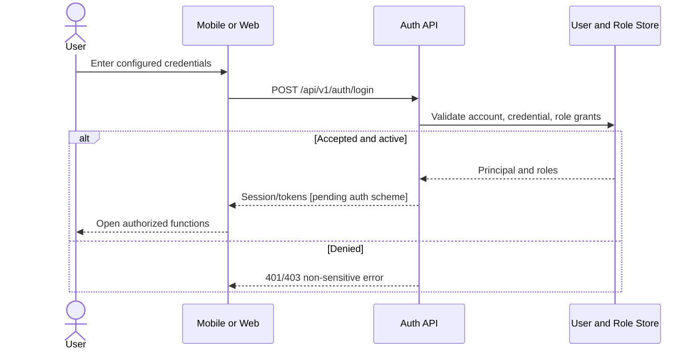

The scheme is intentionally illustrative; OAuth/OIDC versus locally managed credential storage remains OI-001.

# 22. Authorization and Role-Based Access Control

| Resource / action | Worker | Site Leader | Driver | Management/HR | Maintenance | Enrollment Staff |
| --- | --- | --- | --- | --- | --- | --- |
| Verified attendance | Own | If also worker | If also worker | — | — | — |
| Biometric enrollment | Participant | TBD | — | TBD | — | Authorized [derived] |
| Create/geofence edit | — | Authorized | — | Deactivate confirmed | — | — |
| Assign workers | — | Authorized / TBD | — | TBD | — | — |
| Submit shift report | — | Authorized | — | — | — | — |
| QR claim + inspections | — | — | Own session | — | — | — |
| Attendance/report archive | — | Own context TBD | — | Authorized | TBD | — |
| Fleet history/maintenance alerts | — | — | Own context TBD | Authorized | Scoped / TBD | — |
| Flag review + site deactivation | — | — | — | Authorized | Scoped alerts TBD | — |
| Audit events | — | — | — | Authorized | — | — |

**Policy evaluation:** require authentication, then role permission, then ownership/scope for every API request; never trust UI-hidden actions as authorization. A user with multiple roles receives permission unions only within their authorized site/vehicle scopes. Create/update site decisions are evaluated again when offline actions sync. Authorization for worker assignment, maintenance and enrollment is not settled; the table intentionally preserves OI-002/003/008. API control includes IDOR prevention for all `{id}` resources and deny-by-default for unspecified routes.

# 23. Location and Geofencing Design

**Specified baseline.** The proposal describes and the SRS defines a **circular geofence** by `center latitude`, `center longitude`, and `radius in meters` (FR-SITE-002..004). This is not an unresolved circle-vs-polygon choice: use circles for v1. A polygon geometry would be a future scope change requiring revised site requirements, migration and approval.

**Device fix:** capture GNSS-reported lat/lon, horizontal accuracy (if exposed), location timestamp, monotonic acquisition time, and mock-provider/integrity signals. Reject stale, invalid or impossible coordinates; numeric accuracy and border tolerance remain OI-006/007. Calculate proximity only against cached assigned, active, and **valid-at-capture** site versions. Require successful liveness and face match in the *same verification attempt*. The server reevaluates geometry and assignment against the applicable version after sync and flags conflict instead of rewriting original evidence.

**Offline:** the client requires a signed/revisioned cached site+roster snapshot; without reliable cached authority, state is **unverified/pending review**, not a guaranteed valid attendance. Whether stale site revocations invalidate otherwise locally valid events is OI-020 and OI-022. Mock-location flags improve risk detection but cannot detect all signal-level spoofing, rooted-device tampering, relay attacks or replayed evidence. Privacy: check-in/out location only during the attendance attempt, distinct from continuous fleet tracking.

| Boundary model | Fits SRS? | Advantages | Limitations | Conclusion |
| --- | --- | --- | --- | --- |
| Circle: center + radius | Yes | Small payload; cheap on-device haversine; easy site-leader UI | Awkward irregular site borders | **Adopt for v1** |
| Polygon: list of vertices | Not specified | Follows irregular drilling-property boundary | Editing and edge tolerance complexity; new schema/rules | Future change request only |

# 24. Geofence Verification Algorithm

For each currently assigned active site, calculate great-circle distance by Haversine:

\(a = \sin^2(\Delta\phi/2)+\cos(\phi_1)\cos(\phi_2)\sin^2(\Delta\lambda/2)\), \(d=2R\operatorname{atan2}(\sqrt a,\sqrt{1-a})\), with coordinates in radians and `R ≈ 6,371,000 m`. Compare `d` against `radius_m` only if location-age and reported horizontal accuracy satisfy **approved** limits. Exact edge policy (for example “distance + accuracy <= radius” for conservative acceptance) is a **recommendation pending OI-006/007**, not an approved threshold. Do not treat a location whose uncertainty circle crosses a boundary as unequivocally inside. Test anti-meridian/radian conversion, impossible latitudes, site overlap, low accuracy, frozen fixes and stale GPS. If multiple geofences match, worker/site assignment and selected site must determine intended attribution; no automatic site guessing without approved rule.

**D-06 — Attendance location/identity decision.**

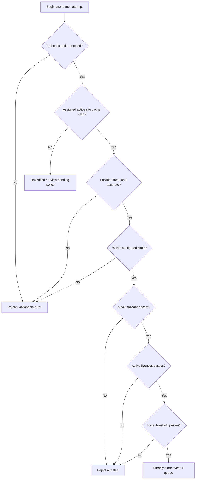

Acceptance depends on *all* checks and a valid identity/site context at capture. Accuracy and cached-permission governance are still awaiting approval.

# 25. Fleet Location Architecture

| Criterion | Driver phone GPS | Dedicated vehicle tracker / OBD2 | Existing tracking provider API | Hybrid |
| --- | --- | --- | --- | --- |
| Accuracy | Phone GNSS; device-dependent | Device/installation-dependent | Vendor-dependent | Can cross-check |
| Reliability | Battery, permissions, app lifecycle dependent | Vehicle-powered; hardware health dependent | Provider uptime dependent | Best coverage if managed |
| Cost | Low up-front; battery/data impact | Hardware + install + subscription | Subscription/API fees | Highest integration cost |
| Tamper resistance | Lower against driver control | Higher against casual app tampering; still vulnerable | Depends on provider trust | Better cross-evidence |
| Integration | Mobile background APIs | Hardware vendor protocol/API | Existing API credentials/integration | Multiple adapters and reconciliation |
| Offline behavior | Local buffering on phone | Tracker store-forward if supported | Vendor-specific offline buffering | More failure paths |
| Pilot feasibility | **Recommended pilot** | Evaluate for production | Only if existing fleet service | Not for initial seven-person pilot |

**[Recommended design – pending stakeholder approval, OI-017].** Implement a `VehicleLocationProvider` interface with `PhoneGpsProvider` for the pilot and a future `Obd2Provider`/third-party provider. Tracking begins at claim and stops at release; `TripLocation.source`, `captured_at`, `received_at`, accuracy and freshness always travel with each point. A separate route distance is retained from odometer-derived custody distance; reconciliation rule is OI-019. Never label a stale last-known coordinate “live.” A hardware tracker does not automatically prove a specific individual drove the vehicle; driver–vehicle binding still comes from authenticated custody claim and inspection evidence.

# 26. Media and Evidence Storage

**Proposed upload path:** (1) capture required images/voice note into app-private encrypted local storage; (2) attach device capture time, GPS, session/vehicle or report ID, SHA-256, MIME and size; (3) persist event/media outbox transactionally; (4) request `/media/uploads/init` after connectivity; (5) upload compressed bytes to a short-lived private URL using chunk/resume support if provider allows; (6) confirm with `/media/{id}/complete`; (7) server rechecks actual content type, checksum, ownership and minimum completeness; (8) link media evidence and mark parent inspection/report synchronized. The database stores metadata and access controls; the object store holds binary bytes.

**Security:** private buckets; no public ACLs; server-verified parent ownership; time-limited GET grants; malware/type checks; EXIF metadata minimized or extracted only under defined evidence policy; client local encryption; object keys not derived from worker names. Retention, format allowlist, upload size, compression targets and deletion policy are [PENDING OI-013/023]. **Biometric enrollment is different:** raw facial enrollment captures must be discarded after embedding generation and must *not* flow through normal MediaObject storage. Failing upload never silently produces a complete inspection at server; locally captured evidence remains pending with visible sync status.

# 27. Detailed Sequence Diagrams

All sequences show the **conceptual domain flow**. On disconnected devices, local capture succeeds only for workflows the SRS allows offline, and the network request happens later via `/api/v1/sync/events`; server acceptance is a separate outcome. Captured timestamps and receiving timestamps must remain distinguishable. The source uses `VehicleSession` consistently for custody and `Trip` for movement. Authentication sequence is D-05 in §21.

**D-07 — Biometric enrollment sequence.**

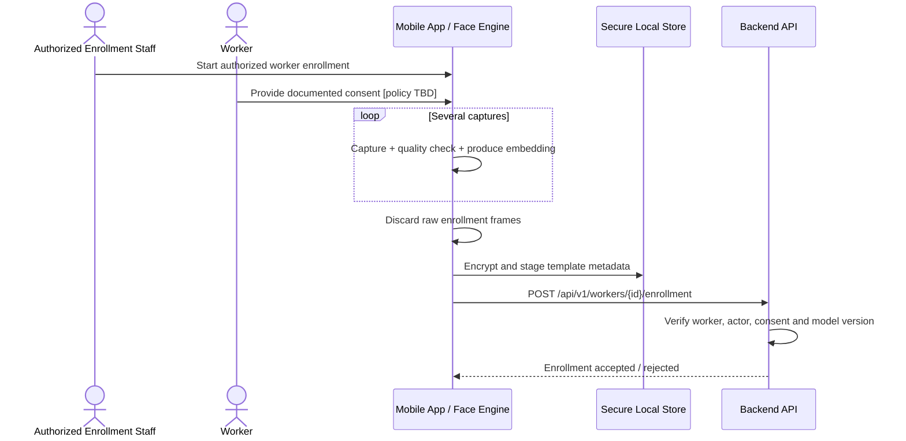

Consent wording and who may enroll remain OI-002/OI-026. No raw enrollment photo is stored or uploaded.

**D-08 — Verified check-in sequence.**

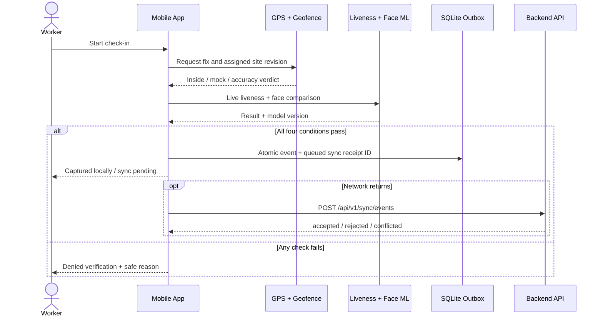

Online `POST /attendance/check-in` uses the same domain validation. Do not turn a locally successful capture into an authoritative server acceptance before sync.

**D-09 — Verified check-out and worked-hours sequence.**

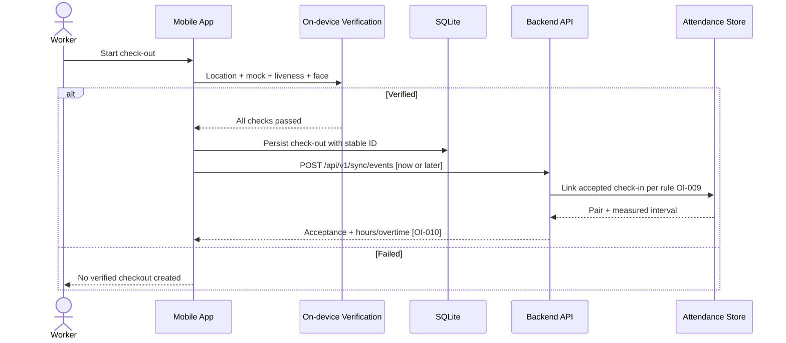

The same four checks apply to check-out. Missing pair, duplicates and payroll exception pathways remain OI-009/010.

**D-10 — Site creation sequence.**

```mermaid
sequenceDiagram
 actor S as Site Leader
 participant M as Mobile App
 participant GPS as GPS or Map Picker
 participant API as Site API
 participant DB as PostgreSQL
 participant AUD as Audit Store
 S->>M: Name site, choose center + radius + assignments
 M->>GPS: Current location or map pin
 GPS-->>M: Coordinates
 M->>API: POST /api/v1/sites
 API->>API: Validate Site Leader role, geometry, roster
 API->>DB: BEGIN; INSERT active site and assignments
 API->>AUD: INSERT immutable site-create audit event
 API->>DB: COMMIT
 API-->>M: siteId + active + revision
```

Newly created site becomes active after authorized creation; offline activation/global site policy is OI-020 and must not be assumed.

**D-11 — Twelve-hour shift report sequence.**

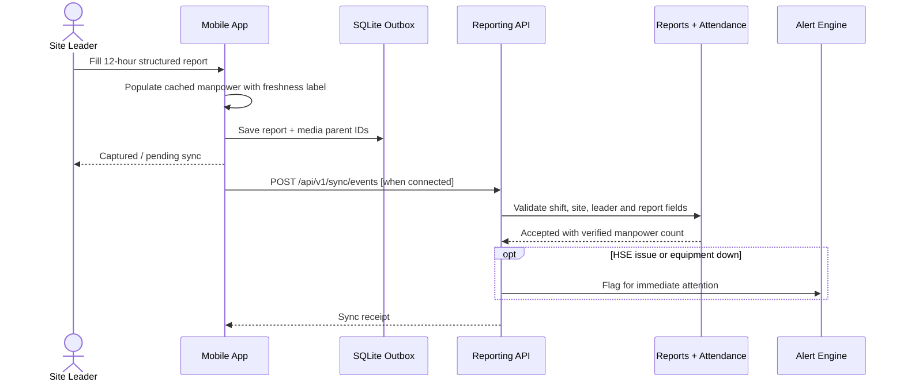

The back end calculates accepted verified manpower from authoritative attendance; offline display is provisional. Missed window scheduler is independent of device availability and can be reconciled later.

**D-12 — QR vehicle assignment sequence.**

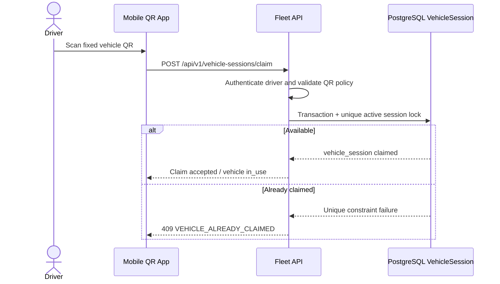

No cloud-wide lock can be guaranteed while both claiming devices are disconnected. For offline claim, explicitly preserve OI-020 and show provisional/not-accepted behavior pending approval.

**D-13 — Pre-trip inspection sequence.**

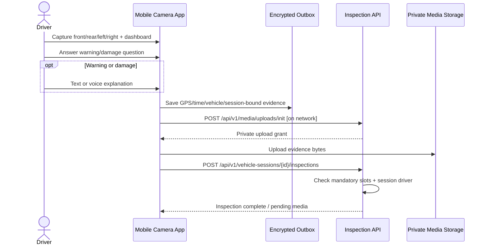

Trip start remains gated until all mandatory pre-trip items are valid. The offline policy for “locally complete, server pending” inspection is a distinct system status.

**D-14 — Trip-start sequence.**

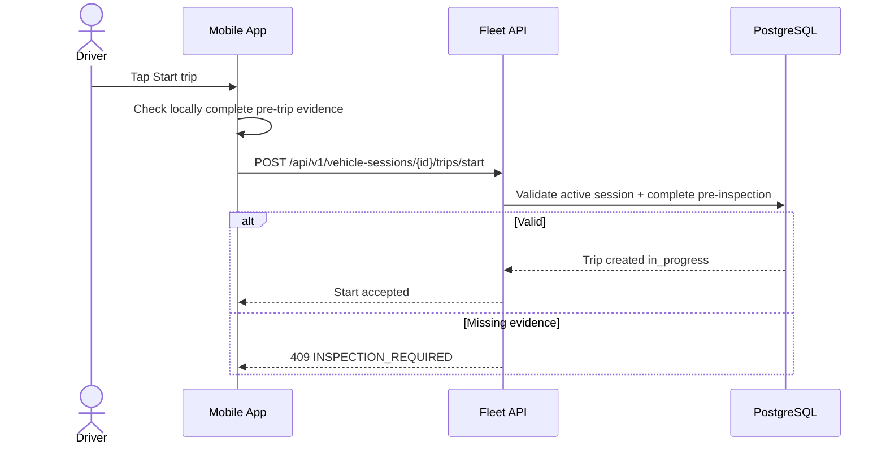

Per proposal the tracking service starts at **claim**, not only after pressing “Start trip”; trip-start gate controls the operational trip state, not the start of custody-scoped sampling.

**D-15 — Trip tracking sequence.**

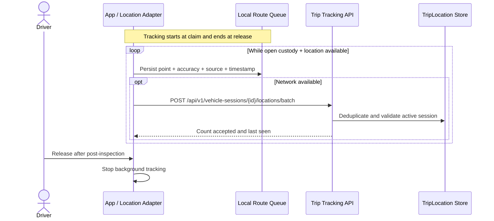

The “live” map displays the latest synchronized point **with freshness timestamp**; history may fill in later.

**D-16 — Trip completion sequence.**

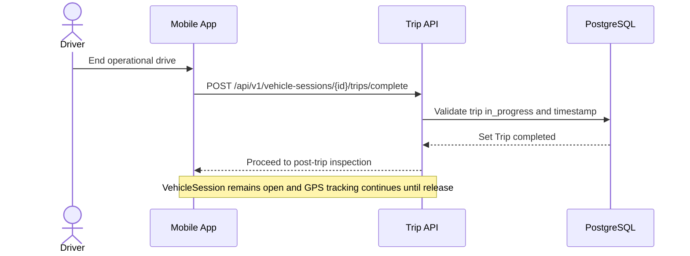

The distinction between trip completion and custody release prevents violating the proposal’s tracking scope.

**D-17 — Post-trip inspection sequence.**

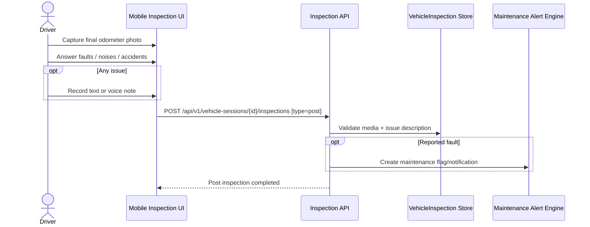

Odometer reading interpretation and reconciliation with GPS distance must be defined (OI-019).

**D-18 — Custody release and sync sequence.**

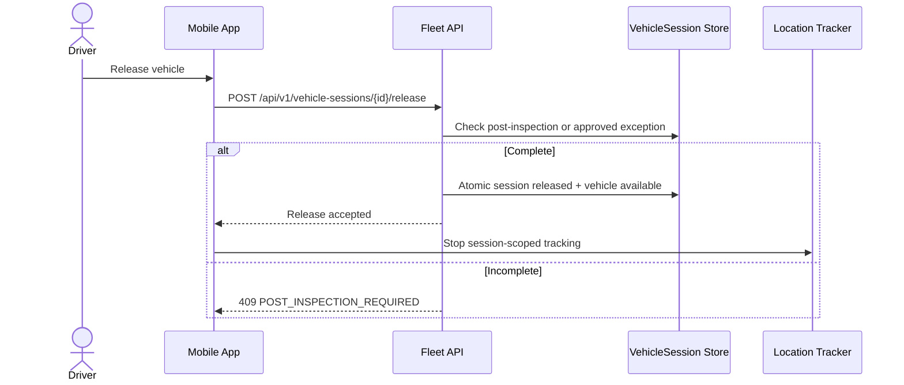

A failed final server call in the desert is the core OI-020 custody conflict; phone should cease unauthorized tracking only according to approved offline release policy, while preserving captured end evidence.

# 28. State Diagrams and Transition Rules

**D-19 — Attendance lifecycle per worker/site/shift.**

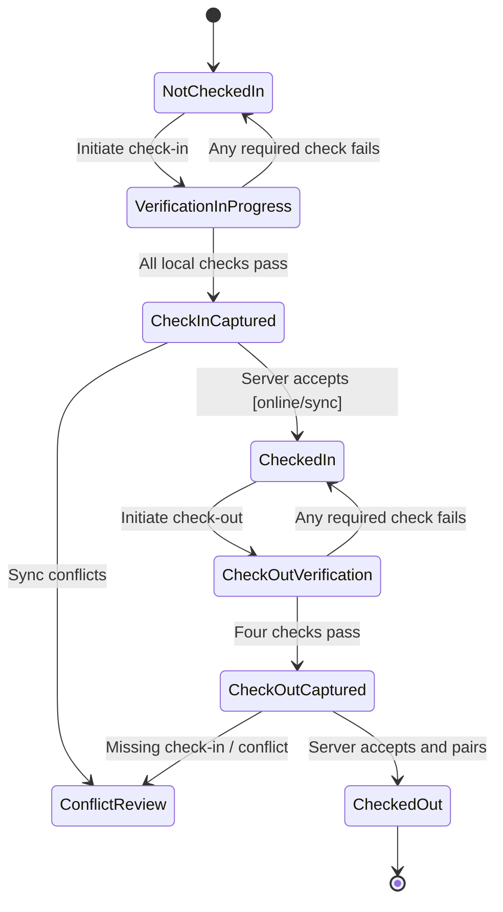

`NotCheckedIn` etc describe a **projection**, not the row status enum for `attendance_events`. Every captured event also has `pending/accepted/rejected/flagged` server-acceptance status. Repeated/missing event policy OI-009 may add exception transitions; invalid transitions must not fabricate verified attendance.

**D-20 — Vehicle custody session lifecycle.**

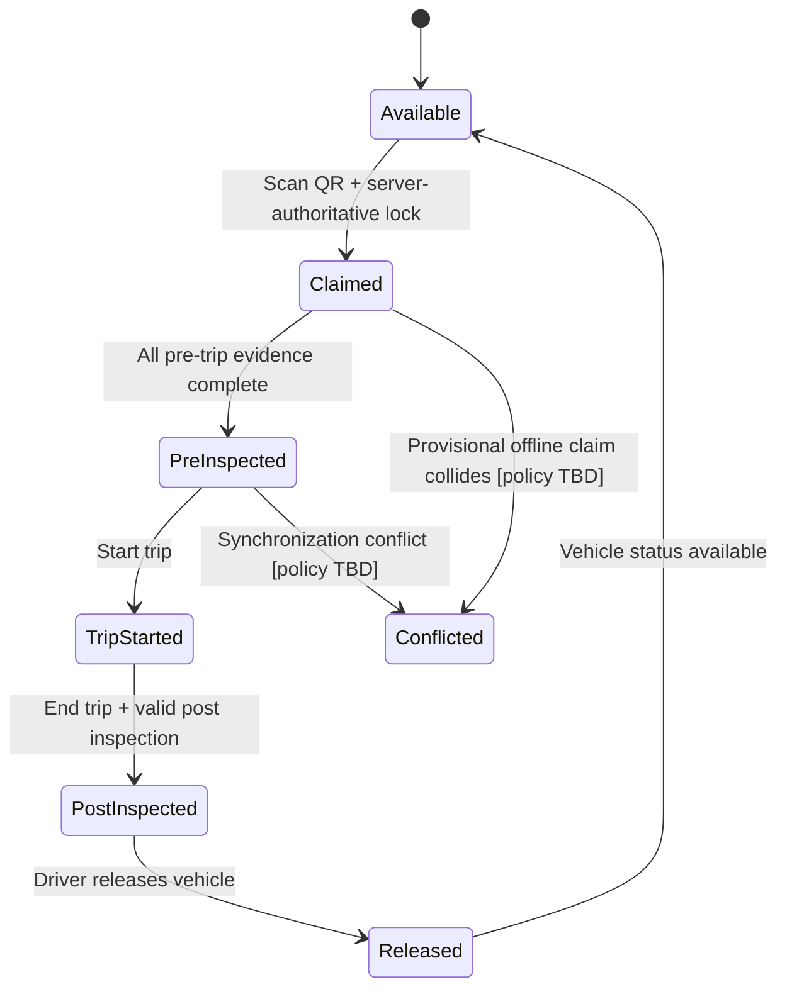

States map to `vehicle_sessions.status` (`claimed`, `pre_inspected`, `trip_started`, `post_inspected`, `released`, `conflicted`) with `Available` as `vehicles.status=available`. Claim is authoritative only with a server lock. Whether post-trip can be completed without a distinct trip-start action is OI-015. Emergency release is OI-016 and is deliberately not assumed.

**D-21 — Trip lifecycle.**

```mermaid
stateDiagram-v2
 [*] --> Pending
 Pending --> InProgress: Trip start authorized after pre-inspection
 InProgress --> Completed: Trip end action
 Completed --> [*]
```

`Trip.status` is `pending / in_progress / completed`. Vehicle custody continues from QR claim until release even after the trip is completed; no direct trip-end release. A broken device must not silently bypass post-inspection.

**Transition validation checklist.** The service checks actor ownership, expected prior state, idempotency ID, `revision`, required evidence completeness, capture-time plausibility and applicable site/vehicle status. Invalid transitions return 409 without modifying historical data. Offline-captured state is a provisional mobile projection and may diverge from authoritative server state; it cannot be converted into two accepted owners of the same vehicle.

# 29. High-Level Domain Class Diagram

**D-22 — Domain classes and core associations.**

```mermaid
classDiagram
 class User {
  +UUID id
  +String accountStatus
  +List~Role~ roles
 }
 class Worker {
  +UUID id
  +String consentStatus
  +String enrollmentStatus
 }
 class BiometricTemplate {
  +UUID id
  +String modelVersion
  +bytes encryptedEmbedding
 }
 class Site {
  +UUID id
  +decimal latitude
  +decimal longitude
  +decimal radiusM
  +long revision
 }
 class SiteAssignment {
  +UUID workerId
  +UUID siteId
  +String status
 }
 class Shift {
  +UUID id
  +DateTime startsAt
  +DateTime endsAt
 }
 class AttendanceEvent {
  +UUID id
  +String type
  +String acceptanceStatus
  +DateTime capturedAt
 }
 class ShiftReport {
  +UUID id
  +decimal progressMetric
  +bool hseIncident
 }
 class Vehicle {
  +UUID id
  +String qrIdentifierHash
  +String status
 }
 class VehicleSession {
  +UUID id
  +String status
  +DateTime claimedAt
  +DateTime releasedAt
 }
 class VehicleInspection {
  +UUID id
  +String inspectionType
  +String completionStatus
 }
 class Trip {
  +UUID id
  +String status
  +decimal odometerDistanceKm
 }
 class TripLocation {
  +DateTime capturedAt
  +decimal lat
  +decimal lon
 }
 class MediaObject {
  +UUID id
  +String sha256Hex
  +String objectKey
 }
 class AuditEvent {
  +UUID actorId
  +String action
  +DateTime occurredAt
 }
 User "1" --> "0..1" Worker
 Worker "1" --> "0..*" BiometricTemplate
 Worker "1" --> "0..*" SiteAssignment
 Site "1" --> "0..*" SiteAssignment
 Site "1" --> "0..*" Shift
 Worker "1" --> "0..*" AttendanceEvent
 Site "1" --> "0..*" AttendanceEvent
 Shift "1" --> "0..*" ShiftReport
 Vehicle "1" --> "0..*" VehicleSession
 VehicleSession "1" *-- "0..2" VehicleInspection
 VehicleSession "1" *-- "0..1" Trip
 Trip "1" *-- "0..*" TripLocation
 ShiftReport "1" o-- "0..*" MediaObject
 VehicleInspection "1" o-- "0..*" MediaObject
 User "1" --> "0..*" AuditEvent
```

Associations distinguish domain parent/child from attachment references. `MediaObject` is not stored inside a report/inspection row; links are represented by `evidence_links`. No inheritance is added solely for illustration.

# 30. Service and Repository Class Design

| Class / interface | Primary method(s) | Responsibility / invariants | Dependencies |
| --- | --- | --- | --- |
| AuthService | authenticate, revoke, principalFor | Validate account/role/session | UserRepo, RoleRepo, security provider |
| EnrollmentService | enrollWorker, deactivateTemplate | Enforce consent/role, encrypt template | WorkerRepo, TemplateRepo |
| LocationVerificationService | evaluateFix(siteSnapshot, fix) | Haversine/accuracy/mock/staleness | DeviceLocationProvider |
| FaceVerificationService | verifyLiveness, compareEmbedding | On-device face model policy | ML runtime, SecureTemplateStore |
| AttendanceService | captureLocal, acceptSyncedEvent, pairShift | All-four checks evidence, server rules | AttendanceRepo, SiteRepo, ShiftRepo |
| SiteService | createSite, reviseSite, deactivateSite | RBAC, revision, immutable audit | SiteRepo, AuditService |
| ShiftReportService | validateReport, submitReport, escalateMissed | 12-hour report/incident flow | ShiftRepo, AttendanceRepo, MediaService |
| VehicleSessionService | claim, startTrip, release | Single accepted active session, gated transitions | VehicleRepo, SessionRepo |
| InspectionService | validateEvidence, finalizeInspection | Photo/answers/issue gating | InspectionRepo, MediaService |
| TripService | appendLocations, completeTrip, calculateDistance | Custody-scoped route and distance | TripRepo, LocationProvider |
| SyncService | acceptBatch, generateReceipt, reconcile | Deduplication, durable receipts, retry policy | SyncReceiptRepo, domain handlers |
| NotificationService | queue, deliver, escalate | Idempotent schedule and fault notifications | NotificationRepo, AlertRepo |
| AuditService | appendEvent, listAuthorized | Append-only critical actions | AuditRepo |
| Repository interfaces | get, save, updateIfRevision | Persist with DB transactions and clear ownership | PostgreSQL + object storage |

Recommended service boundaries coincide with SRS modules, but preserve one deployable process for the pilot. The **mobile** implementation of `LocationVerificationService`, `FaceVerificationService`, and local `AttendanceService` must not require a network call. Backend `AttendanceService` checks evidence consistency and authoritative permissions; it cannot magically re-perform liveness after sync without retaining sensitive data. This limitation must be reflected in the threat model.

# 31. Security Architecture

**31.1 Identity and sessions.** Authenticate using the OI-001-approved mechanism, enforce account status for each protected write, rotate/revoke refresh tokens if adopted, and authenticate scheduled services with short-lived machine credentials. Local biometrics verify an attendance claim and must not replace user login.

**31.2 Authorization.** Deny by default; check action role plus entity ownership and site scope in service and query layer. Management access does not imply unrestricted access to biometric templates. Enforce MFA for privileged roles if approved [PENDING OI-001].

**31.3 Passwords.** Under a local-credential option only, hash using Argon2id, unique salt and appropriately tuned parameters. No plaintext logs or reversible password storage. Password recovery and lockout remain OI-001.

**31.4 API protection.** HTTPS/TLS, strict JSON schemas, IDOR checks, input size limits, scoped upload grants, event idempotency, CORS allowlist for web, CSRF protection if cookie-based sessions selected, and safe error envelopes.

**31.5 Data layer.** Restricted service accounts, encrypted disks/backups, parametrized SQL, separate readonly analytics access, least-privilege DB migrations, uniqueness constraints, encrypted template fields, and tested restore.

**31.6 Transport.** TLS between clients/API and backend dependencies; do not expose the database or object store publicly. Signed uploads expire quickly and reference one authorized parent.

**31.7 Media/evidence.** Compute SHA-256 on device and verify after upload; bind to event/session/vehicle, capture time and location; preserve private ACLs; quarantine invalid MIME/file payloads; inspect malicious uploads with approved service if deployed.

**31.8 Location controls.** Capture GPS accuracy/timestamps/provider flags; Haversine local geofence; server review of cached revision/assignment; mock-location detection; conservative unknown state on poor accuracy; suspicious pattern review. These controls do **not** guarantee anti-spoofing.

**31.9 Fleet tracking.** Consent/purpose-limited custody window; stop collection at release; never silently track outside a session; staff access to routes is scoped/audited; prevent stale points looking live.

**31.10 Audit protection.** Atomic site-change audit inserts, write-once service permission, restricted read, rotation and backup, optional hash-chain tamper-evidence; log access to sensitive records.

**31.11 Admin security.** Role-filtered dashboards, explicit privileged confirmations, no trust in front-end role routing, logged site deactivations and exceptional fleet overrides [PENDING OI-016].

**31.12 Device security.** Secure key storage, app-private encryption, disable debug logging of templates, protect local media, attempt root/emulator/integrity signals only as defense in depth, clear local data under approved logout/revocation policies. Cannot guarantee sensor signals against fully compromised devices.

# 32. Threat Model

| Threat | Target | Likelihood* | Impact* | Mitigation / residual risk |
| --- | --- | --- | --- | --- |
| Proxy check-in by colleague | Attendance | Medium | High | Live face match + liveness; spoofed/compromised sensor remains |
| Photo/video replay | Biometrics | Medium | High | Active challenge with variation; ML bypass residual |
| Mock GPS / GNSS spoof | Geofence | High | High | OS flag, accuracy, timestamp, anomaly detection; hardware-level spoof persists |
| Malicious geofence change | Site trust | Medium | High | Site-leader RBAC, append-only audit, management deactivation |
| Stolen account/token | Protected API | Medium | High | Short-lived sessions, revocation, MFA recommendation; offline revocation lag |
| Cloned/replaced QR | Vehicle identity | Medium | High | QR binding/physical inspection, signed code design option OI-014; not foolproof |
| Two offline drivers claim same vehicle | Fleet custody | High | Critical | No reliable exclusive lock offline; block or provisional policy OI-020 |
| Replay/duplicate sync event | Integrity | High | High | Stable event ID, payload hash, receipts/unique constraints |
| Altered photo/odometer | Inspection evidence | Medium | High | Hash, GPS/time binding, guided capture; cannot independently prove vehicle photographed |
| IDOR/resource guessing | History/privacy | Medium | High | Object-scoped authz for all endpoints |
| SQL injection/file upload abuse | Backend/media | Medium | High | Parameterized SQL, parser limits, MIME/content validation, least privilege |
| Biometric template leak | Privacy | Medium | Critical | Encryption, restricted access, consent/retention policy; templates remain sensitive |
| Audit log tampering | Governance | Low | High | Append-only DB role, chain/backup/alerts; privileged insider risk persists |
| Clock manipulation | Attendance/custody | Medium | High | Server time + monotonic/device drift checks; offline exact time uncertainty OI-022 |

\*Likelihood and impact are qualitative **design-team estimates**, not supplied risk measurements; confirm with the partner. Threat priorities should be revisited after a penetration/privacy review. No control removes all residual risk, particularly malicious/rooted phones and signal-level GPS manipulation.

# 33. Location Spoofing and Anti-Fraud Design

**Primary controls required by SRS:** enforce assigned active site geofence, OS mock-location provider check, active liveness challenge, and enrolled face match simultaneously for each attendance attempt (BR-001 / FR-WFV-016). Any failure means “not verified.” Bind resulting event to user, worker, site revision, device-reported GPS/time, model version and outcomes. Retain flagged attempts only according to approved privacy rule OI-027.

**Defense in depth [DESIGN]:** GNSS quality threshold; capture-age/clock plausibility; device integrity signals; signed config snapshots; comparison against implausible jumps or impossible travel; bounded retries and random challenges; server-side geofence recomputation at sync; admin case review. Exact cutoffs and response ladders are OI-004–007/022/028. Defenders must never replace a failed liveness/match with “location good enough.”

**Known limitations:** phone GPS attests a device-reported location, not immutable physical presence; camera ML provides probabilistic similarity, not identity certainty. A strong adversary can tamper with GPS at signal level or with a compromised device. Do not report these controls as unbreakable in performance metrics or external audit.

# 34. Data Protection and Privacy

| Data class | Why collected | Storage/visibility | Retention / lifecycle |
| --- | --- | --- | --- |
| Worker account and role | Authorization, accountability | Restricted users/roles | OI-023 |
| Face embedding | Attendance identity comparison | Encrypted local/template store, restricted server access if distributed | Consent + withdrawal OI-026; no raw enrollment images |
| Attendance GPS + time | Site/time verification | Encrypted event data; HR/site filtered | OI-023 |
| Trip route and custody | Vehicle accountability | Open session only; restricted fleet dashboard | Tracking stops on release; retention OI-023 |
| Inspection photos/voice | Vehicle condition evidence | Private object store + metadata ACLs | OI-013/023 |
| Shift HSE/incident notes | Operational/safety reporting | Restricted reports + alert view | OI-023 |
| Audit and flagged attempts | Traceability and security review | Protected immutable audit/case view | OI-027 for failed ML attempts |

**Purpose boundaries:** attendance GPS capture is event-based, while continuous route samples are collected **only** inside an open vehicle custody session (NFR-PRIV-002). Minimize precision/retention where operational value does not justify indefinite storage. Encrypted biometric embeddings can still be sensitive/re-identifying and should not be described as necessarily irreversible. Obtain explicit written decisions covering lawful basis, biometric consent, withdrawal, deletion, export and legal-hold workflows (OI-023/026) before production deployment. For a pilot, use anonymized test identities and avoid real biometric data unless appropriate consent and safeguards are in place.

# 35. Encryption and Key Management

**In transit:** require modern TLS for mobile and web HTTPS connections, internal API/database connection as deployed, and object-store signed upload/download. **At rest:** encrypted PostgreSQL volumes/backups, encrypted object storage, encrypted SQLite and media app-private directories using OS keystore-managed secrets. **Field-level:** AES-GCM or equivalent authenticated encryption for face embeddings, with distinct key access path and rotation plan. **Credentials:** Argon2id (only if using local password authentication), never reversible encryption. Store secrets in managed secret storage/environment injection, not source control, mobile bundles or CI logs. Rotate compromised keys; define key-escrow/recovery and deletion with partner [PENDING]. A hash of an image proves bytes unchanged relative to a recorded hash, not that its depicted vehicle/time are truthful.

# 36. Audit Logging Specification

| Event | Actor | Minimum audit content | Failure behavior |
| --- | --- | --- | --- |
| CREATE_SITE / MODIFY_SITE / DEACTIVATE_SITE | Site Leader / Management | site ID, before/after approved fields, actor, timestamp, request ID | Abort site mutation if audit write fails |
| ENROLL_WORKER | Enrollment actor | worker ID, template version, consent reference; no raw face | Enforce consent and authority |
| ATTENDANCE_ACCEPT / FLAG | Worker / system | event ID, site/worker, result; minimal location | Retain failed attempts only after OI-027 |
| VEHICLE_CLAIM / RELEASE | Driver | session/vehicle/driver IDs, server and capture times | Atomic state mutation + audit insert |
| INSPECTION_COMPLETE / ISSUE | Driver | evidence IDs and status without public media URLs | Flag missing evidence/fault |
| REPORT_SUBMIT / REPORT_MISSED | Site Leader / scheduler | site/shift/report IDs, event type/time | Idempotent escalation |
| AUTH_DENIED / RBAC_DENIED | User/system | target action and outcome, sanitized origin | Rate limit/monitor; redact credentials |
| SYNC_CONFLICT / REPLAY | System | event ID, payload digest, conflict code | Preserve both claims for adjudication |

Central `audit_events` records `id`, actor, action, entity type/ID, server `occurred_at`, result, correlation, sanitized metadata and optional chained hashes. Audit records for site changes are **immutable** under application-level credentials; independent backup or secured log sink raises confidence. Maintenance/administrator access to history is logged. The broader audit events above are design extensions justified by the SRS accountability objective; site create/modify immutability is the explicit MUST.

# 37. Error Handling Architecture

**Client classes:** `PermissionDenied`, `DeviceSensorUnavailable`, `LocationUncertain`, `VerificationRejected`, `LocalStorageFailed`, `PendingSync`, `ConflictNeedsReview`, `MediaUploadFailed`, `ServerUnavailable`. Field screens show clear next actions, never cryptographic details or face scores. Offline `PendingSync` is a *status*, not an error or proof of backend acceptance.

**Server classes:** schema validation 422; authentication 401; authorization 403; nonexistent in scope 404; uniqueness/revision/transition conflict 409; payload/rate limits 413/429; transient 503; unexpected 500. Errors use stable codes from §20 and always include a correlation ID. Database exceptions are translated at module boundaries; clients do not receive SQL stack traces.

**Policy-dependent errors:** clock drift (OI-022), offline vehicle collision (OI-020), emergency device failure on post-trip (OI-016), missing check-in (OI-009), stale geofence (OI-006/007/020) must have a defined adjudication path before roll-out. Failing a mandatory camera/verification step may allow retry but never fabricate verified evidence.

# 38. Offline and Weak Connectivity Design

| Operation | Offline allowed? | Local storage | Server sync | Conflict/qualification |
| --- | --- | --- | --- | --- |
| View cached assigned sites | Yes if valid snapshot | Signed/revisioned site cache | Refresh on connection | Stale revocation OI-020 |
| Verified check-in/out | Yes when four checks available | AttendanceEvent + outbox atomic | Required for authoritative acceptance | Site/shift/clock/duplicate conflicts |
| New biometric enrollment | Model local yes, approval policy TBD | Encrypted template only | Required | Who enrolls/consents OI-002/026 |
| Create/activate site | Form capture possible; activation TBD | Pending site proposal | Required before globally active | Other workers cannot see un-synced site |
| Shift report submission | Yes | Report + optional media outbox | Required | Late/missed window + manpower freshness |
| QR claim vehicle | **Blocking decision** | Only provisional if approved | Required global lock | Concurrent disconnected claims unsolvable locally |
| Pre/post inspections | Yes after valid session policy | Private encrypted media + form | Required for authoritative evidence | Photo completeness, claim conflict |
| Trip location tracking | Yes while custody open | Buffered route points | Required | Battery/storage/freshness OI-018/021 |
| Media upload | No network upload; capture yes | Encrypted pending files | Required after connectivity | Incomplete parent until upload verified |
| Admin dashboard live view | No new field data offline | Server last synchronized | Live on connectivity | Stale badge and last seen time |

**Outbox algorithm [DESIGN]:** assign stable `eventId` before capture; commit event + outbox row in one SQLite transaction; preserve capture timestamp and payload hash; order same-session dependencies (`claim -> pre inspection -> trip start -> trip complete -> post inspection -> release`) during replay. Retry network/server transient failures using exponential backoff + jitter, and do not retry deterministic 4xx endlessly. Media uploads resume separately but are referenced by parent event and must be verified before server completion. POST `/sync/events` routes events to same domain handlers as online APIs; `sync_receipts.event_id` and domain unique constraints prevent duplicates. Local statuses: `captured`, `pending`, `uploading`, `accepted`, `rejected`, `conflicted`, `retrying`; after acceptance preserve original evidence, never rewrite `captured_at`. A conflict is retained for authorized resolution, not silently “last write wins.”

**Two critical boundaries:** (1) a disconnected client cannot know that the server has deactivated a site; decide whether prior signed snapshot is temporarily authoritative or requires later review. (2) two independent disconnected phones cannot prove exclusive custody. Proposed safe default is **disable authoritative vehicle claim while offline**, retaining claim form/inspection drafts only; the operational impact must be agreed (OI-020). The proposal also says field vehicle records are captured offline: this tension is an explicit design issue, not a decision to discard offline requirements.

# 39. Caching Strategy

| Cached item | Expiry/invalidation | Security | Reason |
| --- | --- | --- | --- |
| Assigned active sites + geofence revisions | Signed snapshot TTL [TBD], invalidate on sync | Encrypt and bind to account | Offline check-in |
| Worker encrypted embedding/model | Version/consent-aware; revoke when online | OS-keystore key, no raw photo | On-device face comparison |
| Shift schedule + reporting windows | Periodic update; revision/version | Scope to assigned sites | 12-hour report and overtime |
| Vehicle QR/identity reference | Verified latest revision; QR trust OI-014 | No broad fleet roster necessary | Scan in the field |
| Queued attendance/reports/media | Until receipt or approved resolution | Encrypted local storage | Survive outages/reboot |
| Route points | Until confirmed/retention threshold OI-021 | Custody-scoped encryption | Offline trip capture |

Clear protected caches at account switch/logout according to the approved retention and revocation policy. Persist integrity/version metadata with every cached item and event so later sync can identify which policies existed at event time. A cache miss is not permission to accept unverified attendance.

# 40. Concurrency and Data Consistency

**Vehicle claim:** PostgreSQL partial unique index on accepted active sessions plus a single transaction for status/claim. Retried `eventId` returns original receipt; conflicting different `eventId` returns 409, preserving audit. **Release:** require current driver, expected session revision and valid post-inspection; transition session and projected `vehicles.status` atomically. **Site updates:** optimistic `revision` compare-and-swap; audit insert in same transaction; stale offline actions flagged for adjudication. **Attendance:** stable event ID and separate approved duplicate check-in rule OI-009. **Shift reports:** unique ID and optional revision chain; exactly-one active report policy after OI-012. **Trip points:** point UUID + trip/timestamp ordering and sample filtering; do not treat resend as new travel. **Media:** deduplicate upload by media ID + SHA-256, but do not share authorization across parent records implicitly. Exactly-once physical execution is not assumed; the objective is idempotent *logical* acceptance.

# 41. Notification Architecture

| Trigger | Producer | Recipient/view | Delivery semantics | Trace |
| --- | --- | --- | --- | --- |
| Shift report window opens | Shift scheduler | Site Leader notification | Local scheduled notification may assist offline; server authority on sync | FR-REPORT-002; FR-NOTIF-001 |
| Shift report missed window | Shift scheduler | Management escalation + flag | Idempotent (shiftId, triggerType) | FR-REPORT-003..004; FR-NOTIF-002 |
| Report HSE/equipment issue | Report module | Admin flags | Immediate when synchronized | FR-REPORT-018; FR-NOTIF-004 |
| Post-trip mechanical issue | Inspection module | Maintenance view/management | Immediate when synchronized; offline pending noted | FR-FLEET-027; FR-NOTIF-003 |

Implementation: `NotificationService` stores queued delivery attempts, dispatches to chosen push/in-app/email provider adapters, tracks `queued/sent/failed/[acknowledged]`, and retries failures without multiplying flag cases. **[PENDING OI-011 / OI-005]** actual channels, reminder repeats, acknowledgement and escalation policy are not specified. In a disconnected site, “immediate alert” means as soon as server receives the evidence; the dashboard cannot receive unsynchronized events.

# 42. Deployment Architecture

**D-23 — Pilot deployment architecture.**

```mermaid
flowchart TB
 M[Android/iOS Field Clients] -->|HTTPS when online| LB[HTTPS Reverse Proxy]
 W[React Browser Dashboard] -->|HTTPS| LB
 LB --> A[Containerized REST Modular Monolith]
 A --> P[(Managed PostgreSQL)]
 A --> O[(Private Object Storage)]
 A --> J[Scheduled Worker from Same Codebase]
 J --> N[Notification Provider Adapter]
 A -.optional.-> T[External Fleet Tracker Adapter]
 M --> L[(Encrypted SQLite + Media Queue)]
```

Use segregated development, staging and production environments where feasible, independent credentials/buckets and test datasets. Load balancer is optional at initial pilot scale, not a mandate for microservices or Kubernetes.

**Development:** local containers for API/PostgreSQL and mock object storage; emulator/device location and fake biometric data. **Staging:** isolated private test users and synthetic route/media; representative device matrix, rate-limit, offline conflict tests. **Production/pilot:** HTTPS, managed Postgres with backups, private object storage, monitored API and scheduled worker, limited site rollout. Deploy backend/worker from same versioned artifact with leader election or DB advisory lock for scheduled jobs to prevent double escalations. CI checks migrations, OpenAPI compatibility, tests, secret scanning, and rollout/rollback gates. Cloud vendor and exact resource sizing [TBD].

# 43. Environment Configuration

Configuration keys (illustrative, never commit values): `DATABASE_URL`, `OBJECT_STORAGE_BUCKET`, `OBJECT_STORAGE_ENDPOINT`, `AUTH_ISSUER`, `AUTH_AUDIENCE`, `TOKEN_SECRET_REFERENCE`, `MAPS_API_KEY_REFERENCE`, `MEDIA_MAX_BYTES`, `SYNC_BATCH_LIMIT`, `DEVICE_POLICY_VERSION`, `APP_ENV`, `LOG_LEVEL`, `NOTIFICATION_PROVIDER_REFERENCE`. Store production secrets in managed secret vault/CI injection; device public map keys must be restricted at the provider. Application config may specify supported model revisions and shift schedule IDs, but **thresholds are policy inputs, not guessed constants** (OI-004/006/007). Separate migrations, service accounts and buckets for dev/staging/prod; mask private locations/embeddings in diagnostics.

# 44. Scalability Design

**Expected growth:** sites start around two or three concurrently (proposal §2); no precise worker/fleet counts or SLOs are supplied (OI-025). PostgreSQL normalized entities scale naturally for site/worker/vehicle management; the most write-intensive domain is `trip_locations`. Approximate point volume by `N_vehicles × active_hours × 3600 / sampling_interval_seconds`; interval and active count are [TBD OI-018/025]. Report/inspection media may dominate storage bytes, while attendance dominates timestamped structured events at high headcount.

**Capacity levers [DESIGN]:** paginate archive APIs; use indexes in §15; stream/limit route batches; downsample dashboard map visualization without destroying approved raw evidence; compress/upload media separately; rotate/partition `trip_locations` only after volume and retention are measured; scale stateless API replicas before splitting services; offload file bytes to object storage. Evaluate alert/sync worker throughput with burst tests simulating reconnect of multiple field sites. No invented requests/sec, latency SLA or fleet sampling interval is treated as a requirement.

# 45. Reliability and Fault Tolerance

| Failure | System behavior | Persistence / recovery |
| --- | --- | --- |
| Mobile loses network | Continue locally authorized capture, queue | SQLite transaction, backoff resend |
| Backend down | Reject new server authorization; keep local evidence | Retry safely; acknowledge only after durable commit |
| PostgreSQL unavailable | Fail central claim/write; no false success | Backups + controlled recovery; vehicle lock remains unresolved offline |
| Object storage down | Retain encrypted local media; mark pending | Resumable upload; do not finalize evidence |
| GPS unavailable or inaccurate | Do not accept verified attendance | Actionable error; hardware/accuracy policy OI-006 |
| Face model fails/camera denied | No verified attendance event | Retry/fallback only after OI-005 approval |
| Notification provider fails | Persist queued notification with idempotent trigger | Worker retry/monitor delivery |
| Device lost/corrupted before sync | Potential unsynced evidence loss; cannot reconstruct verified events | Encrypted backup feasibility and recovery OI-021/023 |
| Concurrent offline QR claims | Cannot guarantee single exclusive driver | Safe hold/provisional arbitration OI-020 |

# 46. Performance Design

| Path | Design choice | Metric requiring approval |
| --- | --- | --- |
| Check-in/out verification | On-device ML and circle test; no network round-trip | Verification seconds/false rate OI-004/025 |
| SQLite capture | Atomic insert event + outbox before success | Max durable-save latency OI-025 |
| Sync API | Bounded batch, stable IDs, transaction handlers | Reconnect drain duration, error ratio OI-025 |
| Dashboard | Indexed site/time queries + paginated archives + freshness | Near-live refresh target OI-025 |
| Trip points | Compact batches, indexes, optional late partitioning | Sampling/battery/storage OI-018 |
| Media | Compression, separate resumable uploads | Max bytes/format and upload target OI-013 |
| Database | Explain analyze representative high-volume paths | Users/sites/vehicle concurrency OI-025 |

# 47. Observability and Monitoring

Use structured backend logs keyed by `correlationId`, `eventId`, `siteId` or `sessionId` where authorized; **never** log face vectors, enrollment frames, access tokens, full location traces or media bodies. Metrics: API success/error/latency by route; outbox lag, sync conflict/retry rates, queued bytes, stale fleet location age, current active vehicle sessions, missed report escalations, notification delivery failures, media upload checksum errors, DB lock waits, sensor denial rates and model false accept/reject evaluation under approved test settings. Health endpoints must separate service liveness from DB/object-store readiness; do not reveal internals publicly. Security alerts on repeated auth denials, QR collision bursts, unusual geofence edits, replay attempts and audit write failures. Dashboards display source timestamps so consumers distinguish event time from sync arrival.

# 48. Backup and Recovery

Back up PostgreSQL with encrypted point-in-time recovery if deployment supports it, object metadata and blobs with cross-checkable hashes, service configs, and protected audit logs. Test a restoration into staging and verify referential consistency between `media_objects` and actual blobs; restore `vehicle_sessions` before reopening new claims, to avoid duplicate locks. Define **RPO/RTO** only after OI-025, backups/retention under OI-023, and device-outbox recovery under OI-021. Because unsynchronized local records are not in backend backup, display explicit pending state and plan data-loss treatment with stakeholders. Secure all backup credentials and deletion/restore permissions.

# 49. Testing and Verification Considerations

| System area | Critical tests | Mapped criteria |
| --- | --- | --- |
| Authentication + RBAC | Unauthenticated access, role escalation, IDOR, deactivation | AC-AUTH-001; FR-AUTH-* |
| On-device face/liveness | Dust/light/device variation; photo/replay; thresholds and consent | AC-WFV-001/002; NFR-ENV-003 |
| Geofence | Haversine boundary, accuracy, stale GPS, mock provider, overlapping sites | AC-WFV-001/002; OI-006/007 |
| Hours | Check-in/out linking, duplicate/missing case, overtime shift | AC-WFV-003; OI-009/010 |
| Sites | Current GPS vs map pin; audit atomicity; deactivation | AC-SITE-001/002 |
| Reports | 12h window, offline, verified manpower, HSE flag, missed escalation | AC-REPORT-001/002 |
| Vehicle sessions | Parallel SQL claims, offline two-phone collision, QR substitution | AC-FLEET-001; OI-014/020 |
| Inspection gate | Five required pre photos, GPS/time, issue description, final odometer | AC-FLEET-002/004 |
| Trip tracking | Begins claim, stops release, stale map, source substitution | AC-FLEET-003/005 |
| Sync | Retry, crash/restart, duplicate ID, changed hash replay, conflict receipt | AC-SYNC-001 |
| Media | Lost upload, partial checksum, owner ACL, malicious MIME | NFR-REL-005; NFR-SEC-008 |
| Security/privacy | No retained raw enrollment face, encryption, tracked-only-during-custody | AC-PRIV-001; NFR-PRIV-002 |
| Admin | Fresh/stale position, flagged issues, role-scoped archives | AC-ADMIN-001 |

QA should create automated API contract tests from OpenAPI; property-based location and state-machine tests; concurrency tests with two simultaneous claims; reconnect storms with identical and mutated event IDs; migration/backup restore drills; and field usability tests. Verification acceptance cannot be signed off until quantitative performance thresholds and the 28 open questions are resolved by their owners.

# 50. Design Traceability Matrix

| Design component | SRS requirements | Database entity / store | API(s) | Diagrams |
| --- | --- | --- | --- | --- |
| Authentication + RBAC | FR-AUTH-001..009; NFR-SEC-001..002 | users, roles, user_roles | /auth/login, /users, /me | D-05 |
| Biometric enrollment | FR-WFV-001..004; NFR-PRIV-001/004 | workers, biometric_templates | /workers/{id}/enrollment | D-07 |
| Attendance verifier | FR-WFV-005..018; NFR-PERF-001 | attendance_events, sites, workers | /attendance/check-in; /sync/events | D-06, D-08 |
| Hours and checkout | FR-WFV-019..029 | attendance_events, shifts | /attendance/check-out | D-09, D-19 |
| Site creation + governance | FR-SITE-001..011; NFR-SEC-005 | sites, site_assignments, audit_events | /sites, /sites/{id}/deactivate | D-10 |
| 12-hour reporting | FR-REPORT-001..021 | shifts, shift_reports, evidence_links | /shift-reports | D-11 |
| Fleet claim + release | FR-FLEET-001..006,028..032 | vehicles, vehicle_sessions | /vehicle-sessions/claim, /release | D-12, D-18, D-20 |
| Pre/post inspection | FR-FLEET-007..017,023..027,031 | vehicle_inspections, media_objects | /inspections, /media | D-13, D-17 |
| Trip tracking | FR-FLEET-018..024,033..034; NFR-PRIV-002 | trips, trip_locations | /locations/batch, /trips/start | D-14..16, D-21 |
| Administrative dashboard | FR-ADMIN-001..010 | flagged_events, audit_events | /admin/flags, /admin/vehicle-positions | D-01/02/03 |
| Offline sync | FR-SYNC-001..010; NFR-REL-001..006 | sync_receipts; client outbox | /sync/events, /sync/receipts | D-03, D-08/09 |
| Notifications | FR-NOTIF-001..005 | notifications, flagged_events | /notifications | D-11, D-17 |
| Confidentiality + audit | NFR-SEC-003..010; NFR-PRIV-001..006 | audit_events, media_objects, biometric_templates | /admin/audit-events; /media | D-02, D-23 |
| Availability and environment | NFR-AVAIL-001..002; NFR-ENV-001..006 | client SQLite, server stores | /sync/events | D-02/03/23 |
| Performance, scalability, portability | NFR-PERF-001..005; NFR-SCAL-001..002; NFR-COMP-001..003 | all tables | all routes | D-02, D-23 |
| Usability + maintainability | NFR-USA-001..005; NFR-MAINT-001..002 | client cache and all domain stores | all routes | D-02 |

**Complete requirements coverage inventory (generated from every formal FR/NFR row in SRS v1.0).** The family link below is a trace-to-module path; precise design actions appear in the sections and diagrams cited above. The inventory deliberately keeps each SRS ID rather than claiming that unapproved TBDs have been solved.

| Exact SRS ID | Design owner | Design section(s) | Figure(s) |
| --- | --- | --- | --- |
| FR-AUTH-001 | Auth/RBAC | §§21–22 | D-05 |
| FR-AUTH-002 | Auth/RBAC | §§21–22 | D-05 |
| FR-AUTH-003 | Auth/RBAC | §§21–22 | D-05 |
| FR-AUTH-004 | Auth/RBAC | §§21–22 | D-05 |
| FR-AUTH-005 | Auth/RBAC | §§21–22 | D-05 |
| FR-AUTH-006 | Auth/RBAC | §§21–22 | D-05 |
| FR-AUTH-007 | Auth/RBAC | §§21–22 | D-05 |
| FR-AUTH-008 | Auth/RBAC | §§21–22 | D-05 |
| FR-AUTH-009 | Auth/RBAC | §§21–22 | D-05 |
| FR-WFV-001 | Workforce/Attendance | §§8.2–8.3, 23–24 | D-06–09 |
| FR-WFV-002 | Workforce/Attendance | §§8.2–8.3, 23–24 | D-06–09 |
| FR-WFV-003 | Workforce/Attendance | §§8.2–8.3, 23–24 | D-06–09 |
| FR-WFV-004 | Workforce/Attendance | §§8.2–8.3, 23–24 | D-06–09 |
| FR-WFV-005 | Workforce/Attendance | §§8.2–8.3, 23–24 | D-06–09 |
| FR-WFV-006 | Workforce/Attendance | §§8.2–8.3, 23–24 | D-06–09 |
| FR-WFV-007 | Workforce/Attendance | §§8.2–8.3, 23–24 | D-06–09 |
| FR-WFV-008 | Workforce/Attendance | §§8.2–8.3, 23–24 | D-06–09 |
| FR-WFV-009 | Workforce/Attendance | §§8.2–8.3, 23–24 | D-06–09 |
| FR-WFV-010 | Workforce/Attendance | §§8.2–8.3, 23–24 | D-06–09 |
| FR-WFV-011 | Workforce/Attendance | §§8.2–8.3, 23–24 | D-06–09 |
| FR-WFV-012 | Workforce/Attendance | §§8.2–8.3, 23–24 | D-06–09 |
| FR-WFV-013 | Workforce/Attendance | §§8.2–8.3, 23–24 | D-06–09 |
| FR-WFV-014 | Workforce/Attendance | §§8.2–8.3, 23–24 | D-06–09 |
| FR-WFV-015 | Workforce/Attendance | §§8.2–8.3, 23–24 | D-06–09 |
| FR-WFV-016 | Workforce/Attendance | §§8.2–8.3, 23–24 | D-06–09 |
| FR-WFV-017 | Workforce/Attendance | §§8.2–8.3, 23–24 | D-06–09 |
| FR-WFV-018 | Workforce/Attendance | §§8.2–8.3, 23–24 | D-06–09 |
| FR-WFV-019 | Workforce/Attendance | §§8.2–8.3, 23–24 | D-06–09 |
| FR-WFV-020 | Workforce/Attendance | §§8.2–8.3, 23–24 | D-06–09 |
| FR-WFV-021 | Workforce/Attendance | §§8.2–8.3, 23–24 | D-06–09 |
| FR-WFV-022 | Workforce/Attendance | §§8.2–8.3, 23–24 | D-06–09 |
| FR-WFV-023 | Workforce/Attendance | §§8.2–8.3, 23–24 | D-06–09 |
| FR-WFV-024 | Workforce/Attendance | §§8.2–8.3, 23–24 | D-06–09 |
| FR-WFV-025 | Workforce/Attendance | §§8.2–8.3, 23–24 | D-06–09 |
| FR-WFV-026 | Workforce/Attendance | §§8.2–8.3, 23–24 | D-06–09 |
| FR-WFV-027 | Workforce/Attendance | §§8.2–8.3, 23–24 | D-06–09 |
| FR-WFV-028 | Workforce/Attendance | §§8.2–8.3, 23–24 | D-06–09 |
| FR-WFV-029 | Workforce/Attendance | §§8.2–8.3, 23–24 | D-06–09 |
| FR-SITE-001 | Site management | §§8.4, 23, 40 | D-10 |
| FR-SITE-002 | Site management | §§8.4, 23, 40 | D-10 |
| FR-SITE-003 | Site management | §§8.4, 23, 40 | D-10 |
| FR-SITE-004 | Site management | §§8.4, 23, 40 | D-10 |
| FR-SITE-005 | Site management | §§8.4, 23, 40 | D-10 |
| FR-SITE-006 | Site management | §§8.4, 23, 40 | D-10 |
| FR-SITE-007 | Site management | §§8.4, 23, 40 | D-10 |
| FR-SITE-008 | Site management | §§8.4, 23, 40 | D-10 |
| FR-SITE-009 | Site management | §§8.4, 23, 40 | D-10 |
| FR-SITE-010 | Site management | §§8.4, 23, 40 | D-10 |
| FR-SITE-011 | Site management | §§8.4, 23, 40 | D-10 |
| FR-REPORT-001 | Shift reporting | §§8.5, 41 | D-11 |
| FR-REPORT-002 | Shift reporting | §§8.5, 41 | D-11 |
| FR-REPORT-003 | Shift reporting | §§8.5, 41 | D-11 |
| FR-REPORT-004 | Shift reporting | §§8.5, 41 | D-11 |
| FR-REPORT-005 | Shift reporting | §§8.5, 41 | D-11 |
| FR-REPORT-006 | Shift reporting | §§8.5, 41 | D-11 |
| FR-REPORT-007 | Shift reporting | §§8.5, 41 | D-11 |
| FR-REPORT-008 | Shift reporting | §§8.5, 41 | D-11 |
| FR-REPORT-009 | Shift reporting | §§8.5, 41 | D-11 |
| FR-REPORT-010 | Shift reporting | §§8.5, 41 | D-11 |
| FR-REPORT-011 | Shift reporting | §§8.5, 41 | D-11 |
| FR-REPORT-012 | Shift reporting | §§8.5, 41 | D-11 |
| FR-REPORT-013 | Shift reporting | §§8.5, 41 | D-11 |
| FR-REPORT-014 | Shift reporting | §§8.5, 41 | D-11 |
| FR-REPORT-015 | Shift reporting | §§8.5, 41 | D-11 |
| FR-REPORT-016 | Shift reporting | §§8.5, 41 | D-11 |
| FR-REPORT-017 | Shift reporting | §§8.5, 41 | D-11 |
| FR-REPORT-018 | Shift reporting | §§8.5, 41 | D-11 |
| FR-REPORT-019 | Shift reporting | §§8.5, 41 | D-11 |
| FR-REPORT-020 | Shift reporting | §§8.5, 41 | D-11 |
| FR-REPORT-021 | Shift reporting | §§8.5, 41 | D-11 |
| FR-FLEET-001 | Fleet/Inspection/Trip | §§8.6–8.9, 25, 38 | D-12–18, D-20–21 |
| FR-FLEET-002 | Fleet/Inspection/Trip | §§8.6–8.9, 25, 38 | D-12–18, D-20–21 |
| FR-FLEET-003 | Fleet/Inspection/Trip | §§8.6–8.9, 25, 38 | D-12–18, D-20–21 |
| FR-FLEET-004 | Fleet/Inspection/Trip | §§8.6–8.9, 25, 38 | D-12–18, D-20–21 |
| FR-FLEET-005 | Fleet/Inspection/Trip | §§8.6–8.9, 25, 38 | D-12–18, D-20–21 |
| FR-FLEET-006 | Fleet/Inspection/Trip | §§8.6–8.9, 25, 38 | D-12–18, D-20–21 |
| FR-FLEET-007 | Fleet/Inspection/Trip | §§8.6–8.9, 25, 38 | D-12–18, D-20–21 |
| FR-FLEET-008 | Fleet/Inspection/Trip | §§8.6–8.9, 25, 38 | D-12–18, D-20–21 |
| FR-FLEET-009 | Fleet/Inspection/Trip | §§8.6–8.9, 25, 38 | D-12–18, D-20–21 |
| FR-FLEET-010 | Fleet/Inspection/Trip | §§8.6–8.9, 25, 38 | D-12–18, D-20–21 |
| FR-FLEET-011 | Fleet/Inspection/Trip | §§8.6–8.9, 25, 38 | D-12–18, D-20–21 |
| FR-FLEET-012 | Fleet/Inspection/Trip | §§8.6–8.9, 25, 38 | D-12–18, D-20–21 |
| FR-FLEET-013 | Fleet/Inspection/Trip | §§8.6–8.9, 25, 38 | D-12–18, D-20–21 |
| FR-FLEET-014 | Fleet/Inspection/Trip | §§8.6–8.9, 25, 38 | D-12–18, D-20–21 |
| FR-FLEET-015 | Fleet/Inspection/Trip | §§8.6–8.9, 25, 38 | D-12–18, D-20–21 |
| FR-FLEET-016 | Fleet/Inspection/Trip | §§8.6–8.9, 25, 38 | D-12–18, D-20–21 |
| FR-FLEET-017 | Fleet/Inspection/Trip | §§8.6–8.9, 25, 38 | D-12–18, D-20–21 |
| FR-FLEET-018 | Fleet/Inspection/Trip | §§8.6–8.9, 25, 38 | D-12–18, D-20–21 |
| FR-FLEET-019 | Fleet/Inspection/Trip | §§8.6–8.9, 25, 38 | D-12–18, D-20–21 |
| FR-FLEET-020 | Fleet/Inspection/Trip | §§8.6–8.9, 25, 38 | D-12–18, D-20–21 |
| FR-FLEET-021 | Fleet/Inspection/Trip | §§8.6–8.9, 25, 38 | D-12–18, D-20–21 |
| FR-FLEET-022 | Fleet/Inspection/Trip | §§8.6–8.9, 25, 38 | D-12–18, D-20–21 |
| FR-FLEET-023 | Fleet/Inspection/Trip | §§8.6–8.9, 25, 38 | D-12–18, D-20–21 |
| FR-FLEET-024 | Fleet/Inspection/Trip | §§8.6–8.9, 25, 38 | D-12–18, D-20–21 |
| FR-FLEET-025 | Fleet/Inspection/Trip | §§8.6–8.9, 25, 38 | D-12–18, D-20–21 |
| FR-FLEET-026 | Fleet/Inspection/Trip | §§8.6–8.9, 25, 38 | D-12–18, D-20–21 |
| FR-FLEET-027 | Fleet/Inspection/Trip | §§8.6–8.9, 25, 38 | D-12–18, D-20–21 |
| FR-FLEET-028 | Fleet/Inspection/Trip | §§8.6–8.9, 25, 38 | D-12–18, D-20–21 |
| FR-FLEET-029 | Fleet/Inspection/Trip | §§8.6–8.9, 25, 38 | D-12–18, D-20–21 |
| FR-FLEET-030 | Fleet/Inspection/Trip | §§8.6–8.9, 25, 38 | D-12–18, D-20–21 |
| FR-FLEET-031 | Fleet/Inspection/Trip | §§8.6–8.9, 25, 38 | D-12–18, D-20–21 |
| FR-FLEET-032 | Fleet/Inspection/Trip | §§8.6–8.9, 25, 38 | D-12–18, D-20–21 |
| FR-FLEET-033 | Fleet/Inspection/Trip | §§8.6–8.9, 25, 38 | D-12–18, D-20–21 |
| FR-FLEET-034 | Fleet/Inspection/Trip | §§8.6–8.9, 25, 38 | D-12–18, D-20–21 |
| FR-ADMIN-001 | Web dashboard | §§8.12, 22 | D-01–03 |
| FR-ADMIN-002 | Web dashboard | §§8.12, 22 | D-01–03 |
| FR-ADMIN-003 | Web dashboard | §§8.12, 22 | D-01–03 |
| FR-ADMIN-004 | Web dashboard | §§8.12, 22 | D-01–03 |
| FR-ADMIN-005 | Web dashboard | §§8.12, 22 | D-01–03 |
| FR-ADMIN-006 | Web dashboard | §§8.12, 22 | D-01–03 |
| FR-ADMIN-007 | Web dashboard | §§8.12, 22 | D-01–03 |
| FR-ADMIN-008 | Web dashboard | §§8.12, 22 | D-01–03 |
| FR-ADMIN-009 | Web dashboard | §§8.12, 22 | D-01–03 |
| FR-ADMIN-010 | Web dashboard | §§8.12, 22 | D-01–03 |
| FR-SYNC-001 | Outbox + Sync | §§8.13, 38, 40 | D-03, D-08 |
| FR-SYNC-002 | Outbox + Sync | §§8.13, 38, 40 | D-03, D-08 |
| FR-SYNC-003 | Outbox + Sync | §§8.13, 38, 40 | D-03, D-08 |
| FR-SYNC-004 | Outbox + Sync | §§8.13, 38, 40 | D-03, D-08 |
| FR-SYNC-005 | Outbox + Sync | §§8.13, 38, 40 | D-03, D-08 |
| FR-SYNC-006 | Outbox + Sync | §§8.13, 38, 40 | D-03, D-08 |
| FR-SYNC-007 | Outbox + Sync | §§8.13, 38, 40 | D-03, D-08 |
| FR-SYNC-008 | Outbox + Sync | §§8.13, 38, 40 | D-03, D-08 |
| FR-SYNC-009 | Outbox + Sync | §§8.13, 38, 40 | D-03, D-08 |
| FR-SYNC-010 | Outbox + Sync | §§8.13, 38, 40 | D-03, D-08 |
| FR-NOTIF-001 | Notifications | §41 | D-11, D-17 |
| FR-NOTIF-002 | Notifications | §41 | D-11, D-17 |
| FR-NOTIF-003 | Notifications | §41 | D-11, D-17 |
| FR-NOTIF-004 | Notifications | §41 | D-11, D-17 |
| FR-NOTIF-005 | Notifications | §41 | D-11, D-17 |
| NFR-PERF-001 | Performance | §46 | D-02 |
| NFR-PERF-002 | Performance | §46 | D-02 |
| NFR-PERF-003 | Performance | §46 | D-02 |
| NFR-PERF-004 | Performance | §46 | D-02 |
| NFR-PERF-005 | Performance | §46 | D-02 |
| NFR-SEC-001 | Security | §§31–36 | D-02/23 |
| NFR-SEC-002 | Security | §§31–36 | D-02/23 |
| NFR-SEC-003 | Security | §§31–36 | D-02/23 |
| NFR-SEC-004 | Security | §§31–36 | D-02/23 |
| NFR-SEC-005 | Security | §§31–36 | D-02/23 |
| NFR-SEC-006 | Security | §§31–36 | D-02/23 |
| NFR-SEC-007 | Security | §§31–36 | D-02/23 |
| NFR-SEC-008 | Security | §§31–36 | D-02/23 |
| NFR-SEC-009 | Security | §§31–36 | D-02/23 |
| NFR-SEC-010 | Security | §§31–36 | D-02/23 |
| NFR-PRIV-001 | Privacy | §§33–35 | D-06/23 |
| NFR-PRIV-002 | Privacy | §§33–35 | D-06/23 |
| NFR-PRIV-003 | Privacy | §§33–35 | D-06/23 |
| NFR-PRIV-004 | Privacy | §§33–35 | D-06/23 |
| NFR-PRIV-005 | Privacy | §§33–35 | D-06/23 |
| NFR-PRIV-006 | Privacy | §§33–35 | D-06/23 |
| NFR-REL-001 | Reliability | §§38,45 | D-03 |
| NFR-REL-002 | Reliability | §§38,45 | D-03 |
| NFR-REL-003 | Reliability | §§38,45 | D-03 |
| NFR-REL-004 | Reliability | §§38,45 | D-03 |
| NFR-REL-005 | Reliability | §§38,45 | D-03 |
| NFR-REL-006 | Reliability | §§38,45 | D-03 |
| NFR-AVAIL-001 | Availability | §§38,45 | D-02 |
| NFR-AVAIL-002 | Availability | §§38,45 | D-02 |
| NFR-USA-001 | Mobile UI | §§7,37 | D-02 |
| NFR-USA-002 | Mobile UI | §§7,37 | D-02 |
| NFR-USA-003 | Mobile UI | §§7,37 | D-02 |
| NFR-USA-004 | Mobile UI | §§7,37 | D-02 |
| NFR-USA-005 | Mobile UI | §§7,37 | D-02 |
| NFR-SCAL-001 | Scalability | §44 | D-23 |
| NFR-SCAL-002 | Scalability | §44 | D-23 |
| NFR-MAINT-001 | Services + tests | §§7,30,49 | D-22 |
| NFR-MAINT-002 | Services + tests | §§7,30,49 | D-22 |
| NFR-COMP-001 | Mobile/Web adaptation | §§7,42 | D-02/23 |
| NFR-COMP-002 | Mobile/Web adaptation | §§7,42 | D-02/23 |
| NFR-COMP-003 | Mobile/Web adaptation | §§7,42 | D-02/23 |
| NFR-ENV-001 | Field constraints | §§23,38,49 | D-06 |
| NFR-ENV-002 | Field constraints | §§23,38,49 | D-06 |
| NFR-ENV-003 | Field constraints | §§23,38,49 | D-06 |
| NFR-ENV-004 | Field constraints | §§23,38,49 | D-06 |
| NFR-ENV-005 | Field constraints | §§23,38,49 | D-06 |
| NFR-ENV-006 | Field constraints | §§23,38,49 | D-06 |

**Coverage checksum:** 176 unique formal FR/NFR identifiers were found in the uploaded SRS tables and assigned design owners. IDs expressed as ranges in the condensed matrix can be reconciled against this list before acceptance.

# 51. Architecture Decision Records (ADRs)

### ADR-001 — Backend deployment topology

**Status:** Proposed. **Context:** FR-SYNC-006, FR-FLEET-006; NFR-MAINT-001. **Options considered:** Modular monolith vs microservices. **Proposed decision:** Modular monolith REST app. **Rationale:** Single SQL transaction, small team, lower ops overhead. **Consequences/trade-offs:** Scaling later by stateless replication; risk of module coupling. **Approval owner:** project technical lead and named partner stakeholder (refer to §52).

### ADR-002 — Primary database

**Status:** Proposed. **Context:** SRS §8; FR-FLEET-006. **Options considered:** PostgreSQL vs document database vs hybrid. **Proposed decision:** PostgreSQL authoritative + SQLite local. **Rationale:** Proposal §8 relational PostgreSQL; strong integrity for custody. **Consequences/trade-offs:** Manage schema migrations/indexes. **Approval owner:** project technical lead and named partner stakeholder (refer to §52).

### ADR-003 — Geofence representation

**Status:** Derived from approved baseline; edge policy TBD. **Context:** FR-SITE-002..004; FR-WFV-006. **Options considered:** Circle versus polygon. **Proposed decision:** Circle center+radius per SRS. **Rationale:** SRS explicitly defines radius and center. **Consequences/trade-offs:** Irregular boundaries approximate; edge tolerance OI-007. **Approval owner:** project technical lead and named partner stakeholder (refer to §52).

### ADR-004 — Authentication

**Status:** Decision required OI-001. **Context:** FR-AUTH-001..009; NFR-SEC-010. **Options considered:** Existing IdP/OIDC vs local Argon2id + access/refresh session. **Proposed decision:** Prefer partner SSO/OIDC if available; else local managed login. **Rationale:** Minimize custom authentication code and simplify revocation. **Consequences/trade-offs:** Offline token policy and MFA remain undefined. **Approval owner:** project technical lead and named partner stakeholder (refer to §52).

### ADR-005 — Mobile framework

**Status:** Decision required OI-024. **Context:** NFR-COMP-001; FR-WFV-013. **Options considered:** Flutter versus React Native + native ML bridges. **Proposed decision:** Benchmark Flutter and React Native against supported devices. **Rationale:** Cross-platform requirement but no framework dictated. **Consequences/trade-offs:** OS plugin and background GPS feasibility to test. **Approval owner:** project technical lead and named partner stakeholder (refer to §52).

### ADR-006 — Offline event serialization

**Status:** Proposed / pending OI-020/021. **Context:** FR-SYNC-001..010. **Options considered:** Direct online CRUD vs event outbox with server receipts. **Proposed decision:** SQLite transactional outbox + idempotent sync. **Rationale:** Satisfies offline capture and retry. **Consequences/trade-offs:** Conflicts and retention require governance. **Approval owner:** project technical lead and named partner stakeholder (refer to §52).

### ADR-007 — Fleet GPS source

**Status:** Decision required OI-017. **Context:** FR-FLEET-018..022/033. **Options considered:** Driver phone vs OBD2 hardware vs existing provider vs hybrid. **Proposed decision:** Phone GPS pilot with provider interface; evaluate OBD2 for rollout. **Rationale:** No up-front device cost; matches proposal evaluation. **Consequences/trade-offs:** Battery/permission/app integrity residual. **Approval owner:** project technical lead and named partner stakeholder (refer to §52).

### ADR-008 — Offline exclusive fleet claim

**Status:** Blocking OI-020. **Context:** FR-FLEET-006/032; FR-SYNC-009. **Options considered:** Deny offline claim vs provisional claim vs online reservation tokens. **Proposed decision:** Safe default deny global claim while disconnected; partner review. **Rationale:** Cannot guarantee exclusivity independently on disconnected devices. **Consequences/trade-offs:** Offline vehicle operational delay conflicts with full offline promise. **Approval owner:** project technical lead and named partner stakeholder (refer to §52).

### ADR-009 — Media evidence storage

**Status:** Proposed. **Context:** FR-FLEET-015; FR-REPORT-012. **Options considered:** DB BLOB vs private object store + DB metadata. **Proposed decision:** Object storage with signed grants, SHA-256 and evidence links. **Rationale:** Separates bytes from relational metadata. **Consequences/trade-offs:** Retention/security configurations required. **Approval owner:** project technical lead and named partner stakeholder (refer to §52).

### ADR-010 — Historical correction policy

**Status:** Decision required OI-009/012/023. **Context:** FR-REPORT-020; SRS §11. **Options considered:** In-place rewrite vs append/supersede with audit. **Proposed decision:** Append/supersede under approval. **Rationale:** Preserve evidence chain and traceability. **Consequences/trade-offs:** More query complexity; retention/legal rules TBD. **Approval owner:** project technical lead and named partner stakeholder (refer to §52).

### ADR-011 — Trip/session model

**Status:** Decision required OI-015. **Context:** FR-FLEET-018..031. **Options considered:** One trip per custody vs multiple trips per custody. **Proposed decision:** One trip per session pilot; confirm with fleet manager. **Rationale:** Smallest model consistent with proposal wording. **Consequences/trade-offs:** Migration and state machine revision if multi-trip required. **Approval owner:** project technical lead and named partner stakeholder (refer to §52).

# 52. Open Technical Issues and Stakeholder Decisions

**The following 28 questions are copied in substance from SRS §15**, with design recommendations explicitly labeled **nonbinding**. They are the gating worklist for moving this design from proposed to accepted. Each entry must be assigned a decision owner, dated resolution, updated acceptance tests and an ADR before implementation assumptions harden.

| ID | Unresolved SRS question | Recommendation — NOT approved | Affected requirements | Decision owner |
| --- | --- | --- | --- | --- |
| OI-001 | What authentication mechanism, credential policy, recovery flow, and MFA requirements will be used? | Prefer existing OIDC identity platform if present; otherwise reviewed local auth | FR-AUTH-001, FR-AUTH-009, NFR-SEC-010 | Industry partner + Security lead |
| OI-002 | Who is authorized to provision users and perform biometric enrollment? | Authorize HR-enrollment staff explicitly, record consent and supervisory action | FR-AUTH-006, FR-WFV-001 | Industry partner / HR |
| OI-003 | What is the exact role model and permission hierarchy for site leader, supervisor, management, HR, administrator, and maintenance users? | Approve least-privilege site/HR/fleet/maintenance RBAC matrix | FR-AUTH-002..004, FR-SITE-011, FR-ADMIN-* | Industry partner / Product owner |
| OI-004 | What face-match similarity threshold and liveness acceptance criteria will be used, and who may change them? | Tune FAR/FRR and liveness thresholds with field data; sign off model versions | FR-WFV-011, FR-WFV-015, NFR-PERF-004 | AI lead + Industry partner |
| OI-005 | What liveness challenge(s), retry limit, lockout behavior, and fallback process apply after repeated failure? | Document challenge selection and bounded retry/lockout/exception policy | FR-WFV-010..011, FR-WFV-026 | AI lead + Security lead |
| OI-006 | What minimum GPS accuracy is required for attendance, and how should low-accuracy or unavailable GPS be handled? | Define accuracy-age tolerances with representative GNSS tests; conservative accept | FR-WFV-005..007, NFR-ENV-006 | Mobile lead + Industry partner |
| OI-007 | What minimum/maximum geofence radius is allowed and what boundary behavior applies at the edge? | Retain circle baseline; approve radius min/max and conservative edge test | FR-SITE-004, FR-WFV-006 | Industry partner + Mobile lead |
| OI-008 | Who may assign/remove workers from sites, and do assignments require an effective start/end time? | Time-bound assignments with authorized changes and revisioned site policy | FR-SITE-006, FR-WFV-006 | HR / Operations |
| OI-009 | What rules govern duplicate check-ins, repeated attempts, missing check-outs, and check-out without a valid check-in? | No fabricated events; missing/duplicate cases go to documented HR exception | FR-WFV-027..028 | HR / Payroll / Operations |
| OI-010 | How are shift definitions, day/night cycles, standard hours, and overtime rules configured? | Configure site shift timezone, hours and approved overtime formula | FR-WFV-022, FR-REPORT-005 | HR / Operations |
| OI-011 | What is the exact opening/closing duration of the twelve-hour report window, who receives escalations, and are reminders repeated? | Specify reporting windows, local reminders, management escalation and recipients | FR-REPORT-002..004, FR-REPORT-021, FR-NOTIF-005 | Operations management |
| OI-012 | Can a submitted shift report be edited, corrected, approved, rejected, or superseded? | Preserve immutable prior report and append correction if allowed | FR-REPORT-020 | Operations management |
| OI-013 | What attachment file types, maximum sizes, compression limits, and retention periods apply to photos and voice notes? | Set MIME allowlist, size caps, compression and private evidence retention | FR-REPORT-012..013, NFR-PRIV-005 | Product owner + Backend lead |
| OI-014 | What QR code format/security mechanism prevents copied or replaced vehicle QR codes from causing incorrect vehicle claims? | Use opaque authenticated QR reference; physical vehicle confirmation and tamper review | FR-FLEET-002..004 | Security lead + Fleet manager |
| OI-015 | What is the exact allowed order of vehicle claim, inspection, trip start, trip end, post-trip inspection, and release? | Confirm custody vs trip state order and one-vs-many trips per session | FR-FLEET-003..031 | Fleet manager |
| OI-016 | How should the system handle an emergency or device failure that prevents completion of mandatory post-trip steps? | Define authorized emergency exception evidence and later reconciliation | FR-FLEET-031 | Fleet manager + Product owner |
| OI-017 | Which production vehicle location source will be selected: driver mobile phone GPS or OBD2 hardware tracker? | Phone GPS pilot; evaluate OBD2 and existing fleet tracker before production | FR-FLEET-033 | Project supervisor + Industry partner |
| OI-018 | What route sampling frequency, battery budget, offline buffering limit, and location freshness indicators are required? | Specify point interval, buffer/battery budget, and last-seen freshness threshold | FR-FLEET-018..022, FR-FLEET-034 | Mobile lead + Fleet manager |
| OI-019 | How is distance reconciled if odometer-derived distance and GPS-route distance differ? | Store both odometer and route distance, flag material discrepancy | FR-FLEET-021, FR-FLEET-024 | Fleet manager |
| OI-020 | What data is considered authoritative when offline records conflict with backend state? | No globally accepted offline lock without server; approve hold/provisional adjudication | FR-SYNC-009 | Backend lead + Product owner |
| OI-021 | What is the maximum supported offline duration and local queue/media storage capacity? | Set maximum outage duration and protected local storage capacity | FR-SYNC-001..010, NFR-REL-002 | Industry partner + Mobile lead |
| OI-022 | How should the system handle device clock tampering or large clock drift for event timestamps? | Store dual device/server timestamps, detect drift, define trust/adjudication | FR-WFV-017, FR-REPORT-014, FR-FLEET-004 | Security lead |
| OI-023 | What retention, deletion, archival, and legal-hold rules apply to biometric embeddings, attendance, reports, trips, routes, inspections, media, and audit logs? | Approve privacy retention, deletion, backup and legal-hold matrix | NFR-PRIV-005 | Industry partner + Legal/Privacy |
| OI-024 | Which mobile OS versions, device models/capabilities, browsers, and camera/GPS minimums are supported? | Benchmark supported devices/background GPS/ML and browser versions | NFR-COMP-001..003, NFR-ENV-006 | Technical lead |
| OI-025 | What exact measurable performance, availability, concurrency, and synchronization targets are required? | Define measurable availability, latency, concurrency and reconnect sync SLOs | NFR-PERF-002..005, NFR-AVAIL-002 | Project supervisor + Industry partner |
| OI-026 | What worker-consent wording, withdrawal process, privacy notice, and legal basis apply to biometric enrollment and location data? | Legal/privacy-approved biometric consent/withdrawal and notices | NFR-PRIV-004 | Industry partner + Legal/Privacy |
| OI-027 | Should failed liveness/face-match attempts be stored, and if yes, what detail and retention are permitted? | Minimize/limit retention of failed biometric attempt metadata | FR-ADMIN-006, NFR-PRIV-005 | Security + Privacy |
| OI-028 | What response should the system take for specialized signal-level GPS spoofing beyond flagging anomalous patterns? | Escalation and human review for GNSS spoof signals; no auto-certainty | FR-ADMIN-004..005, NFR-SEC-007 | Security lead + Operations |

**Top pre-pilot blockers:** OI-001 authentication; OI-004/005/006 biometric + GPS accuracy; OI-009/010 attendance/payroll rules; OI-014–020 fleet QR/custody/offline conflicts; OI-021/022 outage/clock integrity; OI-023/026 biometric/privacy legal basis; OI-024/025 field devices and measurable acceptance. Remaining items are also open and must be closed according to their risk and phase.

# 53. Architecture Risks and Technical Debt

| Risk | Probability* | Impact* | Mitigation / contingency |
| --- | --- | --- | --- |
| Disconnected fleet double-claim | High | Critical | Stakeholder-approved offline claim policy; conflict audit, lock on reconnect |
| GNSS spoofing/poor desert accuracy | High | High | Accuracy checks, anti-mock, field baselines and spoof anomaly review |
| Low-light/dust face failures | High | High | Representative AI data/accuracy testing; retry/fallback policy approval |
| Excessive background battery usage | Medium | High | Location provider pilot measurement; sampling/energy budget OI-018 |
| Accumulated media / no connectivity | High | High | Bounded queue, encrypted storage, compression, visible storage warnings |
| Leaked biometric templates | Medium | Critical | Encryption, restricted templates, consent/deletion rules and reviews |
| Missed on-device shift notification | Medium | Medium | Backend scheduled escalation plus offline reminders |
| Clock tampering/inaccurate hours | Medium | High | Dual timestamps, drift alerts and approved adjudication |
| Incomplete role boundaries | High | High | Close OI-002/003/008 and test deny-by-default |
| Partner device compatibility | Medium | High | Representative Android/iOS camera/GPS model and ML bridge test |
| Unclear media/historical retention | High | High | Close OI-023 and design purge/hold before production |

\*Ratings are qualitative design-team estimates, not measured incidence rates. **Technical debt watch:** keep a single OpenAPI schema, generated client models, one domain state-machine implementation, explicit ADR approvals and automated traceability; resist duplicated online versus sync handlers. Contract changes affecting the SRS require change control, not quiet implementation.

# 54. Final Architecture Summary

The field **mobile application** performs enrollment, face/liveness and geofence verification, QR/photo capture, shift reports and route sampling using phone hardware and on-device ML. An encrypted **SQLite outbox** persists each event and its media references immediately. Network-independent capture is possible for permitted workflows; server acceptance is explicitly separate. When connectivity resumes, the **REST sync API** validates identity, authorization, payload versions, site rules, duplicate IDs and transaction invariants. A **PostgreSQL modular monolith** owns users/roles, sites/shifts, authoritative attendance, reports, vehicles, inspections, trips, alerts and audit events; **private object storage** retains evidence media without enrollment face photographs. A **React web dashboard** reads synchronized attendance, per-site reporting, vehicle history, maintenance flags and last-known vehicle positions with freshness. Security uses TLS, encryption, RBAC, immutable site-change audits and minimization of biometric/route data. Container deployment with separated environments, backup, observability and test gates supports the pilot without unnecessary microservices or Kubernetes.

**Non-negotiable design limitations to disclose:** face recognition and device GPS do not constitute perfect proof; offline server-side revocations may be unknown; two independently disconnected devices cannot enforce exclusive custody; the location-source choice and many policy/acceptance thresholds require partner decisions. Do not label this proposed architecture implementation-ready for production until those blockers are resolved.

# 55. Diagram Catalogue

| Figure ID | Diagram | Purpose |
| --- | --- | --- |
| D-01 | System context | Context and actors |
| D-02 | Container layout | Container boundaries |
| D-03 | Logical data flow | Information movement |
| D-04 | Core relational ERD | Relational associations |
| D-05 | Authentication sequence | Login/session flow |
| D-06 | Attendance location/identity decision | Four-check attendance decision |
| D-07 | Biometric enrollment sequence | Enrollment |
| D-08 | Verified check-in sequence | Check-in |
| D-09 | Verified check-out and worked-hours sequence | Check-out and hours |
| D-10 | Site creation sequence | Site creation |
| D-11 | Twelve-hour shift report sequence | Shift report |
| D-12 | QR vehicle assignment sequence | Vehicle claim |
| D-13 | Pre-trip inspection sequence | Pre-trip evidence |
| D-14 | Trip-start sequence | Trip start |
| D-15 | Trip tracking sequence | Custody-scoped tracking |
| D-16 | Trip completion sequence | Trip completion |
| D-17 | Post-trip inspection sequence | Post-trip evidence |
| D-18 | Custody release and sync sequence | Release |
| D-19 | Attendance lifecycle per worker/site/shift | Attendance states |
| D-20 | Vehicle custody session lifecycle | Custody states |
| D-21 | Trip lifecycle | Trip states |
| D-22 | Domain classes and core associations | Classes |
| D-23 | Pilot deployment architecture | Deployment |

# 56. Design Completeness Review

The review below checks design-to-SRS consistency, not whether the outstanding questions have already been approved.

| Finding | Type | Severity | Recommendation / disposition |
| --- | --- | --- | --- |
| SRS file is marked Draft for Requirements Review although input instruction calls it approved | Ambiguity | High | Obtain reviewed/approved SRS baseline; do not upgrade status unilaterally |
| Exclusive fleet claim conflicts with offline disconnected multi-device operation | Architecture / Reliability | Critical | Resolve OI-020, then revise fleet flow, data model and tests |
| Site creation “active immediately” cannot propagate instantly to disconnected workers | Consistency | High | Define local provisional versus global active under OI-020 |
| Vehicle tracking starts at claim, but “trip start” is separately gated by inspection | State / API | Medium | Preserved as distinct custody and trip transitions; confirm OI-015 |
| Location source phone/OBD2 unresolved | Technical decision | High | Keep provider abstraction and obtain OI-017 selection |
| Multiple team/worker roles but enrollment and management permissions unclear | Security | High | Finalize OI-002/003/008 role matrix |
| GPS accuracy, face threshold, clock trust and failed attempt retention unresolved | Security / Privacy | High | Close OI-004..007/022/027 before field verification sign-off |
| Manpower in offline shift report may be incomplete until attendance sync | Data consistency | High | Mark provisional local counts; recompute authoritative count on server |
| Server cannot independently rerun on-device liveness from embedding result alone | Security | High | Document mobile trust limit, model attestation options, pilot adversarial tests |
| Odometer and GPS distance may disagree; policy missing | Domain | Medium | Preserve both, resolve OI-019 |
| Retention, consent, supported devices, measurable SLOs still unknown | Privacy / QA | High | Close OI-023..026 and refresh acceptance matrix |
| Evidence link, API names, state enums and diagram names are aligned in this baseline | Architecture | Informational | Keep automated contract/schema tests during implementation |

**Review checklist outcomes.** All four SRS functional modules and all published actors are represented; database entities cover SRS §8, API paths used by sequences are in §18, D-19–21 match proposed state enums, core site-change immutability and evidence privacy are modeled, and full FR/NFR ID coverage is listed in §50. Unresolved role boundaries and business policies are not considered satisfied merely because the design provides placeholders. The proposed one-trip-per-custody and claim-offline policy are the largest candidate changes requiring partner confirmation. Architecture approval should occur only after these high/critical items have owners, resolutions and updated QA criteria.

**End of proposed System Design Document v1.0.**

